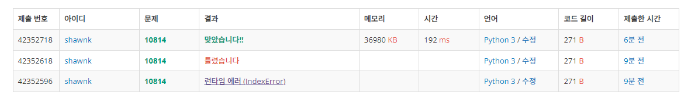

# BAEKJOON 10814 나이순 정렬

### [🏸문제](https://www.acmicpc.net/problem/10814) 

<hr>


### 💊풀이

> **미리 배열을 생성 후 해당 배열에 값을 할당해주자**

1. 미리 나이의 최댓값까지의 범위를 idx로 하는 리스트 배열 생성
2. 주어진 input 값을 받아오면서 나이 -> idx, 이름 - > value 로 하나씩 채워넣는다.
3. 해당 idx의 값의 길이가 0이 아닌 idx를 찾으면서 찾으면 해당 idx를 순회해서 value를 출력한다.
   * 주어진 나이의 범위가 200까지 밖에 안되기 때문에 전부 넣고 순회하는 방식으로 풀어도 된다고 생각

<hr>

### 📌코드

```python
import sys
sys.stdin = open('input.txt')
input = sys.stdin.readline

N = int(input())

arr = [[] for _ in range(201)]

for _ in range(N):
    age, name = input().split()
    arr[int(age)].append(name)  # 나이를 idx로 하고 해당 idx에 이름을 추가

for i in range(201):
    if len(arr[i]) > 0:         # 값이 들어있는 배열만 idx만 순회하면서 나이와 이름 출력
        for j in arr[i]:
            print(f'{i} {j}')
```

<hr>


### 🛀결과



전체 인풋을 넣고 배열을 전부 다 순회한다는 것은 사실 숫자가 클 때는 사용하기 힘든 방법이다. 하지만 이 문제는 나이가 200이고 주어진 input이 만약 10만개가 들어와도 한 번만 순회하면 되기 때문에 문제 없다고 생각했다. 파이썬의 경우 보통 1초에 2000만 개의 연산이 가능하다고 생각하면 되기 때문에 10만 개면 누워서 떡 먹기 수준이다.(~~*물론 실제로 누워서 떡 먹기는 매우 위험..;;*~~)
