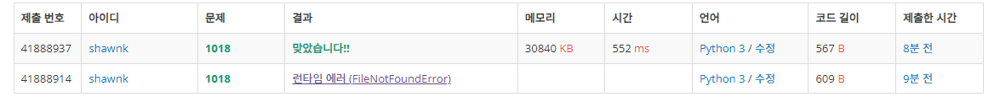

# BAEKJOON 1018 체스판 다시 칠하기

https://www.acmicpc.net/problem/1018

<hr>


### 풀이

1. 브루트 포스로 모든 경우를 다 확인하면 된다.
1. B 부터 시작하는 8x8 배열과 W부터 시작하는 8x8배열을 만든다
1. 주어진 배열을 8x8 배열씩 순회하며 앞에서 만들어 놓은 배열과 비교하며 가장 다른 것이 적은 값으로 갱신해나간다.

<hr>


### 코드

```python
import sys
sys.stdin = open('input.txt')

N, M = map(int, input().split())
arr = [input() for _ in range(N)]

check1 = ['BWBWBWBW','WBWBWBWB'] *4 # B부터 시작하는 2차원 배열 생성
check2 = ['WBWBWBWB','BWBWBWBW'] *4 # W부터 시작하는 2차원 배열 생성

mmin = 1000000000                   # 최소값을 구하기 위해 나올 수 없는 큰 수로 초기화

for i in range(0,N-7):
    for j in range(0,M-7):
        cnt1 = 0
        cnt2 = 0
        for p in range(8):
            for q in range(8):
                if list(map(lambda n:n[j:j+8],arr[i:i+8]))[p][q] != check1[p][q]: # 8x8배열을 순회하며 B 부터 시작하는 check1과 비교
                    cnt1+=1
                if list(map(lambda n:n[j:j+8],arr[i:i+8]))[p][q] !=check2[p][q]: # 8x8배열을 순회하며 W 부터 시작하는 check2와 비교
                    cnt2+=1
        mmin = min(cnt1,mmin,cnt2) # 가장 작은 값으로 갱신
print(mmin)
```

<hr>


### 결과

### 

브루트 포스와 구현 문제이다. 경우의 수 두 가지를 모드 탐색하는 것인데 처음 이 문제를 도전했을 때는 너무 너무 어렵게 느껴졌다. 하지만 성장했나? ㅋㅋ 지금 풀어보니 매우 간단하게 해결하였다.

