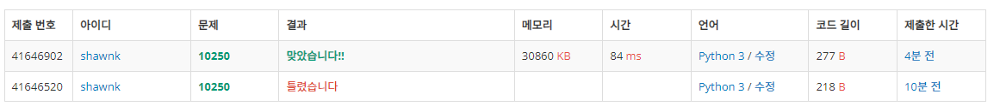

# BAEKJOON 10250 ACM 호텔

### 문제 

https://www.acmicpc.net/problem/10250

<hr>


### 풀이

1. 호를 출력하기 위해 나머지와 몫을 이용한다.

<hr>


### 코드

```python
import sys
sys.stdin = open('input.txt')
T = int(input())

for tc in range(T):
    H, W, N = map(int, input().split())

    h=str(N%H)                              # 높이는 사람 수를 높이로 나눈 나머지

    w=str(N//H+1)                           # 가로 번호는 사람 수를 높이로 나눈 몫 +1
    if h=='0':                              # 만약 높이로 사람 수를 나누었을 떄 나머지가 0이면
        h = str(H)                          # 높이는 주어진 높이
        w = str(int(w)-1)                   # 방 수는 사람 수를 높이로 나눈 몫
    if len(w)==1:
        print(f'{str(h)+str(0)+str(w)}')
    else:
        print(f'{str(h) + str(w)}')
```

<hr>


### 결과



처음에는 사람 수가 층의 높이로 완전히 나누어 떨어지는 경우를 고려하지 않았다. 해당 부분만 고려하면 쉽게 풀 수 있는 문제이다.