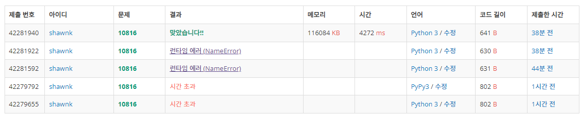

# BAEKJOON 10816 숫자 찾기2

### [🏸문제](https://www.acmicpc.net/problem/10816) 

<hr>


### 💊풀이

> 이진 탐색에서 중복된 숫자를 찾기위해 upper와 lower 개념을 이용한다.

1. 찾는 값 이상의 값이 나타나는 위치를 찾는다.
2. 찾는 값을 초과하는 값이 나타나는 위치를 찾는다.
3. 이상의 값을 찾을 때는 min 값이 최종적으로 당겨진다.
4. 초과하는 값을 찾을 때는 max 값이 최종적으로 당겨진다. 

<hr>


### 📌코드

```python
import sys
sys.stdin = open('input.txt')
input = sys.stdin.readline

def lower_search(value):            # 찾는 값보다 이상인 값이 처음 나타나는 곳을 찾는다.
    min = 0                         # left
    max = N                         # right (결국에는 min이 한 칸씩 max방향으로 딸려오면서 위치를 파악하니까 max의 범위는 N까지)
    while min < max:                # 값을 찾으면 max는 그 위치로 이동하고 min을 계속 당겨오면서 값이 처음 나타나는 곳을 찾는다.
        mid = (max+min)//2
        if arr_N[mid] >= value:     # 현재 값이 value보다 크거나 같으면 max값을 당겨옴 (제일 처음 위치로 점점 이동)
            max = mid
        else:
            min = mid+1             # 현재 값이 value보다 작으면 mid+1 위치로 min 값을 이동
    return min

def upper_search(value):            # 찾는 값을 초과하는 값이 처음 나타나는 곳을 찾는다.
    min = 0
    max = N
    while min < max:                # 값을 찾으면 min을 계속 당겨오면서 값을 초과하는 순간 max만 계속해서 당겨와진다. 결국 교차되는 순간 종료
        mid = (max+min)//2
        if arr_N[mid] <= value:
            min = mid+1
        else:
            max=mid
    return min

N = int(input())
arr_N = list(map(int,input().split()))
arr_N.sort()

M= int(input())
arr_M = list(map(int, input().split()))

for i in arr_M:
    print(upper_search(i)-lower_search(i), end=' ')

```

<hr>


### 🛀결과



처음에 이진 탐색 후 양쪽을 while 루프를 통해 같은 값이 존재하는지 탐색해보았다. 하지만 이렇게 할 경우에 모든 숫자가 같을 때는 이진 탐색을 하는 의미가 없어지게 된다.(모든 수를 결국 다 순회해야하니까..) 따라서 주어진 배열을 정렬했을 때 내가 찾는 수가 나타나는 처음 위치와 마지막 위치를 찾는 방법으로 접근하는 것이 효율적이다. 처음 수가 나타나는 곳은 내가 찾는 값의 이상을 찾는 방식으로 이진 탐색을 하고, 마지막 위치를 찾는 방법은 내가 찾는 수를 초과한 값이 나타나는 수를 찾는 방식으로 접근한다.

**upper와 lower 잊지 말자!**