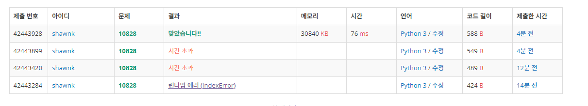

# BAEKJOON 10828 스택

### [🏸문제](https://www.acmicpc.net/problem/10828) 

<hr>


### 💊풀이

> input을 sys.stdin.readline을 통해 받아야 시간 초과를 피할 수 있다

1. sys.stdin.readline을 통해 input을 받아온다.
1. 문제에서 주어진 명령어가 input에 존재하는지 확인
1. 해당 input에 따른 결과 값을 출력

<hr>

### 📌코드

```python
import sys
sys.stdin = open('input.txt')
input = sys.stdin.readline

def stack(data):
    if 'top' in data:
        if len(arr) !=0:
            return(arr[-1])
        else:
            return(-1)
    elif 'size' in data:
        return(len(arr))
    elif 'pop' in data:
        if len(arr)==0:
            return(-1)
        else:
            return(arr.pop())
    else:
        if len(arr) == 0:
            return(1)
        else:
            return(0)

N = int(input())

arr = []
for _ in range(N):
    data = input()
    if 'push' in data:
        arr.append(data.split()[1])
    else:
        print(stack(data))
```

<hr>


### 🛀결과



처음에 sys.stdin.readline을 안쓰고 그냥 input을 받았더니 시간 초과에 걸렸다. 함수로 만들어서 코드를 작동시키면 속도가 더 조금 걸린다는 글을 본 적이 있어서 해당 부분으로 진행해보았지만 역시나 시간 초과...

결국에는 sys.stdin.readline을 사용해서 input 값을 받아오니 가뿐하게 통과하였다. 좋구만~
