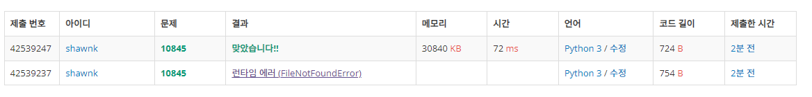

# BAEKJOON 10845 큐

### [🏸문제](https://www.acmicpc.net/problem/10845) 

<hr>


### 💊풀이

> input을 sys.stdin.readline을 통해 받아야 시간 초과를 피할 수 있다

1. sys.stdin.readline을 통해 input을 받아온다.
1. 문제에서 주어진 명령어가 input에 존재하는지 확인
1. 해당 input에 따른 결과 값을 출력
1. Q 를 구현하면 된다.

<hr>

### 📌코드

```python
import sys
sys.stdin = open('input.txt')
input = sys.stdin.readline

N = int(input())

rear = front = -1
Q = []
for _ in range(N):
    data = input()
    if 'push' in data:
        rear += 1
        Q.append(data.split()[1])
    elif 'front' in data:
        if front == rear:
            print(-1)
        else:
            print(Q[front+1])
    elif 'back' in data:
        if front == rear:
            print(-1)
        else:
            print(Q[rear])
    elif 'size' in data:
        print(rear-front)
    elif 'pop' in data:
        if front == rear:
            print(-1)
        else:
            print(Q[front+1])
            front += 1
    elif 'empty' in data:
        if front == rear:
            print(1)
        else:
            print(0)
```

<hr>


### 🛀결과



Q를 구현하는 문제이다. Q를 class를 써서도 구현 가능한데 나중에는 class를 사용해서 구현하는 것도 다시 연습해봐야 겠다. 시간 초과를 피하기 위해 sys.stdin.readline을 써줘야 된다는 사실을 잊지 말자!
