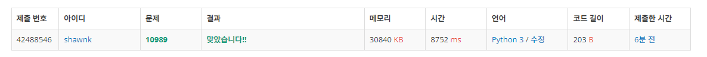

# BAEKJOON 10989 수 정렬하기 3

### [🏸문제](https://www.acmicpc.net/problem/10989) 

<hr>


### 💊풀이

> 숫자의 범위만큼 미리 배열을 생성해서 문제를 풀자!

1. 들어올 input의 최대 범위만큼 배열을 생성
1. input을 idx로 해서 배열의 해당 idx의 value에 +1
1. input을 다 받고나면 배열을 순회하면서 idx를 value 값만큼 반복해서 출력

<hr>

### 📌코드

```python
import sys
sys.stdin = open('input.txt')
input = sys.stdin.readline

arr = [0 for _ in range(20001)] # 입력값을 idx하로 하는 배열 생성

N= int(input())

for _ in range(N):              # 입력값이 들어오면 해당 값을 idx로 하여 value에 +1
    arr[int(input())] += 1

for i in range(20001):          # 전체 배열을 순회하면서 value 값만큼 idx를 출력
    for _ in range(arr[i]):
        print(i)
```

<hr>


### 🛀결과



수의 범위가 주어진 문제들은 처음에 해당 범위 만큼을 크기로 갖는 배열을 생성하는 것이 문제를 풀 때 매우 효과적인 것 같다. 이번 문제도 그렇게 접근을 했더니 쉽게 해결이 됐다. 퀵정렬, 병합 정렬 등 알고리즘을 적용했을 때 과연 시간 내에 가능한가도 나중에 시도해보겠다. ~~(한 방에 성공!)~~
