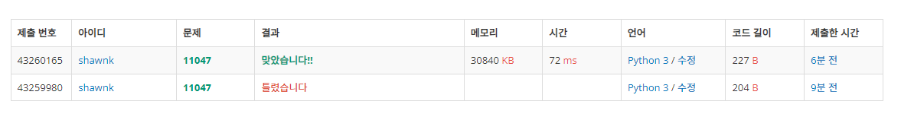

# BAEKJOON 11047 동전 0

### [🏸문제](https://www.acmicpc.net/problem/11047) 

<hr>


### 💊풀이

> 나누기 후 몫가 나머지를 이용

1. 동전이 주어진 수보다 큰지 작은지 파악
1. 주어진 수보다 같거나 작을 때만 배열에 뒤에서부터 채움(나중에 들어온 수가 앞으로 배치)
1. 배열을 순회하며 해당 동전으로 주어진 수를 나눈다
1. 나눈 몫이 해당 동전을 내야하는 개수
1. 나눈 나머지가 남은 동전으로 내야하는 돈
1. 모든 순휘를 끝내고 동전을 내야하는 총 개수를 더해줌

<hr>

### 📌코드

```python
import sys
sys.stdin = open('input.txt')

N, M = map(int,input().split())

arr = []
for _ in range(N):
    value = int(sys.stdin.readline().rstrip())
    if M >= value:                              # 동전의 값이 M보다 같거나 작으면 배열에 담기
        arr = [value] + arr                     # 큰 동전이 앞으로 오도록 배열을 뒤집어서 받아준다.

cnt = 0
for i in arr:                                   # 배열을 순회
    cnt += M//i                                 # 동전으로 나눈 몫이 해당 동전을 내는 수
    M %= i                                      # 동전으로 나눈 나머지가 남은 동전들로 내야되는 남은 값
print(cnt)                                      # 모든 동전을 내는 수를 더해서 출력
```

<hr>


### 🛀결과



처음에는 dfs를 이용해서 풀어볼까 생각했다. 하지만 작은 수가 주어졌을 때 dfs를 너무 많이 돌아서 실패했는데 지금 생각해보니 배열을 뒤집어서 dfs 탐색을 시작하고 처음으로 동전의 값과 동일하게 완성됐을 때 바로 종료 시켜버린다면 가능할 것 같기도 하다. 하지만 지금 풀이가 훨씬 더 간결하고 깔끔하게 풀어진 것 같아서 아주아주 만족스럽다 ㅎㅎ! *~~(잘했쥬!)~~*
