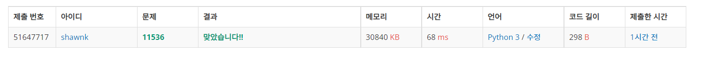

# BAEKJOON 11536 줄 세우기

### [🏸문제](https://www.acmicpc.net/problem/11536) 

<hr>


### 💊풀이

> 이름을 입력 받은 후 앞에서부터 순서대로 대소 비교를 한다.

1. 문자열 입력을 받는다.
1. 모든 이름을 순서대로 idx를 이동하며 대소 비교를 한다.
1. 정렬이 되어 있다면 모든 배열이 1 또는 0으로만 나타난다. 그렇지 않다면 정렬되어 있지 않은 것!

<hr>

### 📌코드

```python
import sys
sys.stdin = open('input.txt')

def solution_1(name): # 파이써닉
    order = [name[i] > name[i + 1] for i in range(0, N - 1)]    # 문자열 간의 대소 비교를 통해 1번과 2번, 2번과 3번 ~ 을 끝까지 반복
    if sum(order) == N - 1: # 대소 비교한 값을 다 더했을 때 1이라면 내림차순 정렬되어있다는 것
        print('DECREASING')
    elif sum(order) == 0:   # 대소 비교한 값을 다 더했을 때 0이라면 오름차순 정렬 되어있다느 ㄴ것
        print('INCREASING')
    else:                   # 이 외에 중간 중간 0과 1이 섞여있다면 정렬되지 않은 것
        print('NEITHER')

N = int(input())
name = [input() for _ in range(N)]

# print(name)
# print(name[3] > name[4])
# print([list(map(lambda n:ord(n), i)) for i in name])


```

<hr>


### 🛀결과



파이썬서는 문자열도 대소 비교가 가능하기에 쉽게 해결 할 수 있는 문제이다. 또한 문자열 간의 대소 비교 뿐만 아니라 아스키 문자로 변환을 통해 해결하는 방법도 생각해보았다. 끝까지 구현은 하지 않았지만 주석에 있는 코드와 같이 변환 후 이차원 리스트를 대소 비교하는 방법으로 정렬 할 수 있다.! 굳
