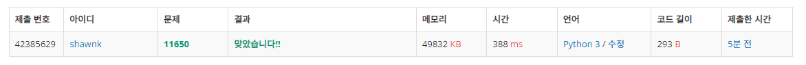

# BAEKJOON 11650 좌표 정렬하기

### [🏸문제](https://www.acmicpc.net/problem/11650) 

<hr>


### 💊풀이

> 필요한 idx만큼을 미리 생성해놓고 해당 배열에 값을 넣고 순회한다.

1. 주어지는 수의 개수는 10만 개, 파이썬은 1초에 연산 1000만 번 가능, 제한 시간은 1초 (완전 탐색 가능)
2. 주어진 input의 x 좌표 값을 idx로 하는 배열 생성
3. 값이 주어지면 해당 idx에 y좌표 값을 append
4. 값이 존재하는 idx값만 정렬해서 출력

<hr>


### 📌코드

```python
import sys
sys.stdin = open('input.txt')
input = sys.stdin.readline


N = int(input())
arr = [[] for _ in range(200001)]       # 미리 x좌표 만큼의 배열 생성

for _ in range(N):
    x, y = map(int, input().split())
    arr[x+100000].append(y)             # 음수를 제거해주기 위해 음수 최대 범위 만큼을 더해줌

for i in range(200001):
    if len(arr[i])>0:
        for j in sorted(arr[i]):        # 해당 idx에 값이 존재하면 정렬해서 순차적으로 뽑아낸다.
            print(f'{i-100000} {j}')

```

<hr>


### 🛀결과



문제를 풀 때 가장 먼저 고려할 부분은 완전 탐색으로 풀 수 있는가? 이다. (효율적인 해결은 그 다음!) 해당 문제의 input 값과 주어진 시간 제한 그리고 완전 탐색 시 시간 복잡도를 고려해서 해당 문제가 완전 탐색으로 풀 수 있다면 그렇게 풀면 된다. 더욱 더 효율적으로 풀기보다 지금처럼 일단 문제를 풀 수 있는 방법을 찾자!
