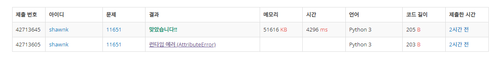

# BAEKJOON 11651	좌표 정렬하기2

### [🏸문제](https://www.acmicpc.net/problem/11651) 

<hr>


### 💊풀이

> sort 함수에서 key와 lambda를 활용한다.

1. input을 받아와 튜플 형태로 배열에 추가해준다.
1. sort에 key - > lambda를 활용해 x기준 그리고 y 기준 순으로 정렬한다.

<hr>

### 📌코드

```python
import sys
sys.stdin = open('input.txt')

N = int(sys.stdin.readline().rstrip())

arr = []
for _ in range(N):
    x, y = map(int,input().split())
    arr.append((x,y))

arr.sort(key = lambda  n : (n[1],n[0])) # x 기준, y 기준 순으로 정렬한다
for i in arr:
    print(*i)
```

<hr>


### 🛀결과



지난번에 풀 때는 배열을 미리 생성해놓고 풀었는데 이번에는 sort에 key와 lambda를 활용해서 풀어보았다.

여러가지 방법을 활용해서 풀기 위해 노력 중이다!!
