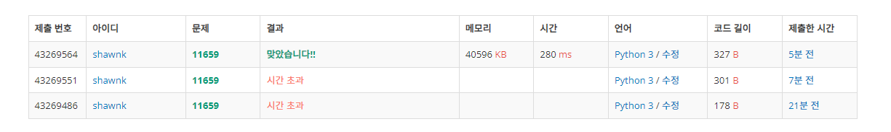

# BAEKJOON 11659 구간 합 구하기4

### [🏸문제](https://www.acmicpc.net/problem/11659) 

<hr>


### 💊풀이

> 주어진 배열의 누적합을 구해놓고 필요한 부분만 가져다 사용하자

1. input 배열의 누적합을 구해준다.
1. 합을 구하는 구간의 시작이 1부터면 end-1을 idx로하는 value 를 출력
1. 합을 구하는 구간의 시작 1부터가 아니면 end-1을 idx하는 value에서 start-2를 idx로 하는 value를 빼주면 해당 구간의 누적합

<hr>

### 📌코드

```python
import sys
sys.stdin = open('input.txt')

N, M = map(int, input().split())

arr = list(map(int,sys.stdin.readline().split()))

for i in range(1,len(arr)):
    arr[i] = arr[i-1] + arr[i]                              # 입력 받은 배열의 누적합을 구한다

for _ in range(M):
    start, end = map(int, sys.stdin.readline().split())
    if start == 1:                                          # 합을 구하는 구간이 1부터면 end-1을 idx로 하는 value가 누적합
        print(arr[end-1])
    else:
        print(arr[end-1] - arr[start-2])                    # 합을 구하는 구간의 시작이 1보다 크면 end-1을 idx로하는 value에서 start-2를 idx로 하는 value를 빼줌
```

<hr>


### 🛀결과



처음에는 문제를 어떻게 풀어야되는지 몰라서 해당 구간을 index slicing을 통해서 잘라내서 합을 구해주었다. 이렇게 했더니 시간 초과가 발생했다. 그 다음에 고민을 하다가 배열의 누적합을 구해놓고 해당 구간에 해당하는 value만 뽑아내자! 라는 생각이 들었다. 그렇게 진행해도 시간초과가 발생했는데 그 이유는 input의 양이 워낙 많아서 sys.stdin.readline() 으로 input을 받아오지 않아서였다. sys.stdin.readline()을 통해 input을 받아오니 바로 해결!
