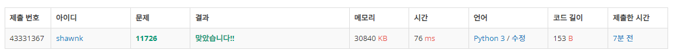

# BAEKJOON 11726 2 x n 타일링

### [🏸문제](https://www.acmicpc.net/problem/11726) 

<hr>


### 💊풀이

> 점화식을 찾아서 dp를 통해 해결하자

1. input의 수 +1 만큼 배열 초기화
1. 0, 1,2 idx의 value들은 기저 조건으로 0,1,2 로 value 초기화
1. 3 번 idx 부터 arr[i] = arr[i-2]+arr[i-1] 의 규칙을 갖는다.

<hr>

### 📌코드

```python
import sys
sys.stdin = open('input.txt')

arr = []
for i in range(0,int(input())+1):
    arr.append(i)

for i in range(3,len(arr)):     # 1, 2번은 기저 조건
    arr[i] = arr[i-2]+arr[i-1]  # 3번 부터 이와 같은 점화식을 통해 값을 구한다.
print(arr[-1]%10007)
```

<hr>


### 🛀결과



규칙을 찾는 것이 중요한 문제이다. 규칙을 찾아내는 것이 항상 문제를 풀 때마다 어렵다. 이 문제가 정말 규칙이 있는 것인가, 완전 탐색을 통해 해결해야 하는 문제인가를 한 번에 알기 어렵기 때문이다. 하지만 이 문제는 느낌적으로... 규칙이 있다는 것을 알 수 있었고 어떤 규칙이 있을지 고민해보았다. 처음에는 직접 수를 세고 이전 수들이랑 비교해보면 빠르게 알 수 있겠지만 다른 방법으로 고민해보고 싶었다. 그래서 이전 칸의 배열을 다음 칸의 배열과 비교해보며 조합을 통해 수를 구하는 방법도 접근 해보았다. (현재 타일에서 2X1 타일을 추가하면 나음 칸이 이전 타일링과 같아진다는 것을 통해 규칙을 찾고 싶었다.) 하지만 생각보다 까다로워 수를 나열 후 규칙을 찾는 방법으로 진행했다. ㅜㅜ
