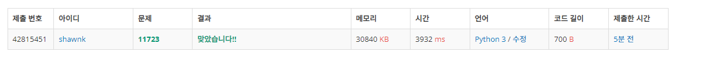

# BAEKJOON 11723 집합

### [🏸문제](https://www.acmicpc.net/problem/11723) 

<hr>


### 💊풀이

> set() 자료 구조를 사용한다

1. set 자료 구조를 생성
1. input을 받고 특정 단어가 input에 들어있는지 확인
1. 특정 단어가 input에 들어있다면 그에 해당하는 조건을 처리

<hr>

### 📌코드

```python
import sys
sys.stdin = open('input.txt')

N = int(input())

sset = set()

for i in range(N):

    data = input()
    if 'add' in data:
        sset.add(int(data.split()[1]))
    elif 'remove' in data:
        if int(data.split()[1]) in sset:
            sset.remove(int(data.split()[1]))
    elif 'check' in data:
        if int(data.split()[1]) in sset:
            print(1)
        else:
            print(0)
    elif 'toggle' in data:
        if int(data.split()[1]) in sset:
            sset.remove(int(data.split()[1]))
        else:
            sset.add(int(data.split()[1]))
    elif 'all' in data:
        sset = set((range(1,21)))
    elif 'empty' in data:
        sset = set()
```

<hr>


### 🛀결과



파이썬에는 set()이라는 집합을 처리할 수 있는 자료구조가 있어서 쉽게 해결이 가능하다.

대부분의 연산을 set을 통해 해결 할 수 있다. *~~(파이썬 충성!)~~*
