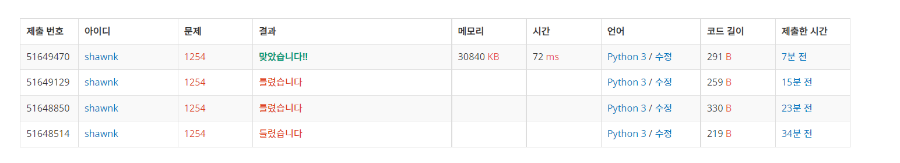

# BAEKJOON 1254 팰린드롬 만들기

### [🏸문제](https://www.acmicpc.net/problem/1254) 

<hr>


### 💊풀이

> 입력을 받아서 뒤집은 문자열과 하나씩 idx를 이동하며 같아질 때까지 반복한다.

1. 문자열 입력을 받는다.
1. 받은 문자열을 뒤집고 기존 문자열과 하나씩 idx를 움직이면 비교한다.
1. idx를 이동했을 때 뒤집은 문자열과 기존 문자열이 같아진다면 이동한 수만큼 기존 문자열 수에 더해준다.

<hr>


### 📌코드

```python
import sys
sys.stdin = open('input.txt')

def get_pallindrome(S):
    length = len(S)
    cnt = 0
    for i in range(length):
        if cnt == 0:    # 문자열 idx를 아직 이동하지 않았을 때
            if S == S[::-1]:    # idx를 아직 이동하지 않고 기존 문자열과 뒤집은 문자열이 같으면 회문
                return length
        elif S[cnt:] == S[::-1][:-cnt]: # idx를 이동하면서 뒤집은 문자열과 기존 문자열 비교
            return length + cnt # 같아면 기존 문자열 길이에 이동한 idx만큼 추가
        cnt += 1
S = input()
print(get_pallindrome(S))

```

<hr>


### 🛀결과



처음에는 패턴을 찾아내려고 하다 보니 오히려 더 문제를 어렵게 풀게 되었다. 때문에 회문의 특징인 좌우 대칭만을 고려하여 어디서부터가 좌우대칭 시작점인지를 찾아내고, 좌우 대칭이라면 해당 부분은 더이상 반복하지 않아도 되기에 그 수만큼만 기존 문자열에 더해주었다. 

쉽게 쉽게 풀어보자 좀 ㅜ.ㅜ
