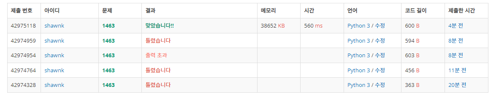

# BAEKJOON 1463 1로 만들기

### [🏸문제](https://www.acmicpc.net/problem/1463) 

<hr>


### 💊풀이

> dp를 사용하여 이전 값들을 활용하자

1. N의 크기 (1~3)에 따라 맞춰서 기저 조건 초기화
1. idx 3부터 dp를 순회하면서 해당 idx가 2와 3으로 나눠지면 나눈 몫을 idx 로하는 value 와 이전 값 +1 중 최소값으로 초기화
1. 2와 3으로 나누어지지 않으면 이전 값 +1로 초기화

<hr>

### 📌코드

```python
import sys
sys.stdin = open('input.txt')

N = int(input())

dp = [9999999] * (N+1)

if N==1:                                                # dp 기저 조건 초기화
    dp[0:2] = [0,0]
elif N==2:
    dp[0:3] = [0,0,1]
else:
    dp[0:4] = [0, 0, 1,1]

for i in range(3,len(dp)):                              # 기저 조건 이후부터 dp 순회
    if i % 2 == 0 and i % 3 ==0:                        # 이전 값의 +1과 나눈 몫을 idx로 하는 값 중 최소값을 비교
        dp[i] = min(dp[i-1]+1,dp[i//2]+1,dp[i//3]+1)
    elif i % 2 == 0:
        dp[i] = min(dp[i - 1] + 1, dp[i // 2]+1)
    elif i % 3 == 0:
        dp[i] = min(dp[i - 1] + 1, dp[i // 3]+1)
    else:
        dp[i] = dp[i - 1] + 1

print(dp[-1])
```

<hr>


### 🛀결과



오랜만에 dp 문제를 푸니까 접근 방법을 생각하는게 쉽지 않았다. 많은 고민 끝에 해답을 찾을 수 있었다. 하지만 처음 기저 조건을 경우에 따라 나누어 준 방식을 깔끔하게 해결 할 수도 있을 것 같았는데 그 방법을 모르겠다... 다른 사람들이 푼 코드를 보니까 나보다 훨씬 깔끔하게 풀었다... 부럽다..*~~(나도 열심히 해야지!)~~*
