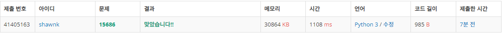

# BAEKJOON 14502 치킨 배달

### 문제 

https://www.acmicpc.net/problem/14502

<hr>


### 풀이

1. 1부터 M 까지로 구성할 수 있는 치킨집의 경우의 수를 모두 구하기
2. 해당 경우의 수가 구해질 때마다 치킨집과 가정집의 거리를 구해서 최솟값으로 갱신

<hr>


### 코드

```python
import sys
sys.stdin = open('input.txt')

def get_combi(arr,start,n,temp):                    # 치킨집의 경우의 수를 구하는 함수
    if len(temp) == n:
        get_dist(home_idx,temp)

    for i in range(start,len(arr)):
        if visit[i] == 0:
            visit[i] = 1
            get_combi(arr, i, n, temp+[arr[i]])
            visit[i] = 0

def get_dist(home, chicken):                        # 치킨집과 가정집 사이의 최단 거리를 구하는 함수
    global cnt
    result = 0
    for i in home:
        mmin = 1000
        for j in chicken:
            dist = abs(j[0]-i[0])+abs(j[1]-i[1])
            if dist < mmin:
                mmin = dist
        result += mmin
    if result < cnt:
        cnt = result

N, M = map(int, input().split())
arr = [list(map(int, input().split())) for _ in range(N)]

home_idx = []
chicken = []
for i in range(len(arr)):                                   # 미리 치킨집과 가정집의 idx를 구함
    for j in range(len(arr)):
        if arr[i][j] == 1:
            home_idx.append([i+1,j+1])
        if arr[i][j] == 2:
            chicken.append([i+1,j+1])


visit = [0]*(len(chicken)+1)

cnt = 1000000
for i in range(1,M+1):                                      # 치킨집의 idx를 가능한 수에 대해 가능한 경우의 수를 모두 구해서 가정집과의 거리를 비교함
    chicken_good = []
    get_combi(chicken, 0,i,[])

print(cnt)
```

<hr>


### 결과



조합을 이용한다면 쉽게 풀 수 있는 문제였다. 구현도 그리 까다롭지 않아서 쉽게 풀었다고 생각한다. 다만 모든 경우를 전부 고려하다보니 시간이 살짝 아쉬운 것 같다. 백트래킹을 어떻게 하면 할 수 있을지 고민하면 좋겠다.