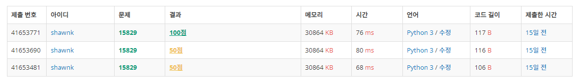

# BAEKJOON 15829 Hashing

### [🏸문제](https://www.acmicpc.net/problem/15829) 

<hr>


### 💊풀이

> 아스키 코드로 변환하여 범위를 확인한다.

1. 주어진 수를 아스키 코드로 변환하여 확인한다.


### 📌코드

```python
import sys
sys.stdin = open('input.txt')
N = int(input())
arr = input()
cnt = 0
for i in range(N):
    cnt += (ord(arr[i])-96) * (31**i)	# 주어진 값을 변환하여 범위 확인
print(cnt%1234567891)
```

<hr>


### 🛀결과



문제를 너무 대충 읽어서 처음에 변환 해쉬값(엄청 큰 소수)이 주어진 것을 확인을 못했었다.

때문에 해당 값을 결과에서 mod 연산을 취해주지 않아서 점수가 50점만 나왔다. 해당 부분을 처리해주니 바로 답이 맞았다!!
