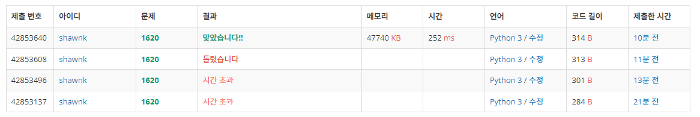

# BAEKJOON 1620 나는야 포켓몬 마스터 이다솜

### [🏸문제](https://www.acmicpc.net/problem/1620) 

<hr>


### 💊풀이

> 딕셔너리를 사용하여 속도를 빠르게 하자

1. input (포켓몬 이름) 을 key, 들어온 순서를 value로 dictionary에 추가
1. dictionary의 key들을 list로 미리 만들어 놓음
1. 문제 input이 숫자면 key_list에서 해당 idx의 포켓몬 출력
1. 문제 input이 문자면 dictionary의 해당 키의 value 출력

<hr>

### 📌코드

```python
import sys
sys.stdin = open('input.txt')

N, M = map(int, input().split())

arr = {}
for i in range(1,N+1):
    arr[(sys.stdin.readline().rstrip())] = i # 포켓몬의 이름을 key 값, 들어오는 순서를 value 로 dictionary에 추가
    i+=1

data = list(arr.keys())                      # dictionary의 key 값들을 리스트로 바꾸어줌

for _ in range(M):
    value = sys.stdin.readline().rstrip()
    if value.isnumeric():                    # input이 숫자면 data에서 해당 idx의 포켓몬 출력
        print(data[int(value)-1])
    else:
        print(arr[value])                    # input이 문자면 dictionary의 해당 key의 value 출력

```

<hr>


### 🛀결과



처음에 그냥 리스트로 만들고 문제를 풀려고 했을 때는 시간 초과가 발생했다. 그래서 포켓몬의 이름을 key로 하는 dictionary를 만들어서 문제를 풀었다. dictionary는 key 값에 해시 함수를 적용해 고유한 index를 만들어 놓기 때문에 나중에 key를 알면 해시 함수를 통해 바로 index를 찾을 수 있어서 시간 복잡도가 O(1)이다. 따라서 dictionary를 통해 접근하면 시간 복잡도를 훨씬 낮출 수 있다.*~~(dictionary 만세!!)~~*
