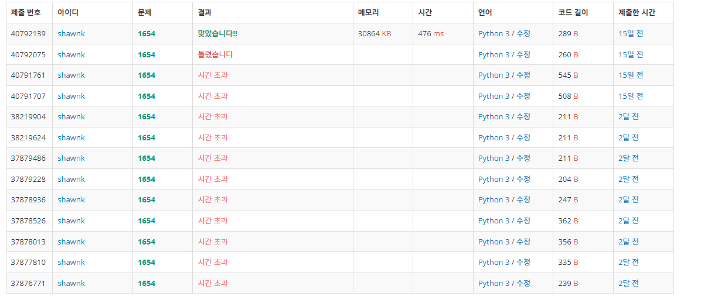

# BAEKJOON 1654 랜선 자르기

### 문제 

https://www.acmicpc.net/problem/1654

<hr>


### 풀이

이진 탐색을 하지 않으면 시간 초과를 피할 수 없는 문제이다. 주어진 N값과 동일 할 때까지 최대한 이진 탐색을 진행해서 mid 값을 출력하면 된다.

<hr>


### 코드

```python
import sys
sys.stdin = open('input.txt')

K, N = map(int,input().split())

arr = [int(input()) for _ in range(K)]

start = 1
end = max(arr)

while start <= end:                                 # start가 end를 넘어서면 종료
    mid = (start + end) // 2                        # 가운데를 중심으로 양쪽 탐색
    if sum(list(map(lambda n:n//mid, arr))) >= N:   # 주어진 N과 값이 같거나 크면 start를 mind+1로 당겨옴
        start = mid+1
    else:                                           # 그렇지 않다면 마지막 지점을 당겨옴
        end = mid-1
        mid = (start+end)//2
print(mid)
```

<hr>


### 결과



처음에 문제를 풀었을 때는 이진 탐색 알고리즘에 대해 알지 못하여서 그리드한 방식으로 접근하였다. 그러다보니 숫자 커지면 탐색의 수가 너무 많아져서 시간 초과가 발생하였다. 후에 알고리즘에 대해 어느정도 공부한 후에는 이진 탐색 방법으로 접근을 하였고, 이때 아직 이진 탐색 구현에 대한 정확한 이해가 부족해서 처음에 틀리기도 했다.

아직도 완벽하게 이해한 것은 아니라고 생각이 들어 이진 탐색 알고리즘 문제를 몇 개 더 풀어보면 좋을 것 같다.