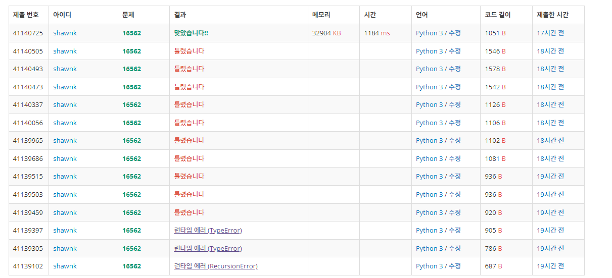

# BAEKJOON 16562 친구비


### 문제 

https://www.acmicpc.net/problem/16562

<hr>


### 풀이

친구 수만큼 순회를 돌면서 해당 친구의 간선 정보를 바탕으로 친구를 사귀는 최솟값을 구한 후 기존 값보다 작으면 업데이트 한다.

이후 간선에서 만나지 못한 친구들의 비용을 각각 더해주어 총 친구비가 주어진 한계 금액(K) 보다 높다면 친구를 사귈 수 없음으로 Oh no를 프린트한다.

<hr>


### 코드

```python
import sys
sys.stdin = open('input.txt')

N, M, K = map(int, input().split())

price_all = [0] + list(map(int, input().split()))
arr = [[0] for _ in range(N+1)]
visit = [0] * (N+1)

def dfs(start):
    global min
    global all
    all.append(start)
    stack = [start]

    while stack:
        value = stack.pop()
        if price_all[value] < min:
            min = price_all[value]

        for j in arr[value]:
            if visit[j] != 1:
                visit[j] = 1
                stack.append(j)
                all.append(j)


for _ in range(M):
    f1, f2 = map(int, input().split())
    if arr[f1] == [0]:
        arr[f1] = [f2]
    else:
        arr[f1].append(f2)
    if arr[f2] ==[0]:
        arr[f2] = [f1]
    else:
        arr[f2].append(f1)

price = 0
all = []

for i in range(1,N+1):
    if visit[i] != 1 and arr[i] != [0] and price_all[i] + price<=K:
        visit[i] = 1
        min = price_all[i]
        dfs(i)
        price += min

for i in range(1,N+1):
    if i not in all:
        price += price_all[i]

if price <= K :
    print(price)
else:
    print("Oh no")


```

<hr>


### 결과



엄청나게 돌아가서 풀었다... 결국 성공은 했지만 의미있게 푼 건 아니라는 생각이 들었다.

간선에 들어있지 않은 친구들을 따로 계산해주었는데 이 부분을 처음부터 같이 돌아야 코드가 길어지지 않고 전부 순회할 수 있다.

dfs에 대한 이해가 부족해서 많이 돌아가는 풀이가 된 것 같다. dfs를 더 확실하게 공부해야 한다.