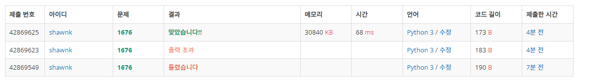

# BAEKJOON 1676 팩토리얼 0의 개수

### [🏸문제](https://www.acmicpc.net/problem/1676) 

<hr>


### 💊풀이

> N! 을 10**i 로 나눈 나머지가 0이 아닌 경우를 찾아

1. N! 계산
1. N!을 10**i 로 나눈 나머지를 찾는다.
1. 나눈 나머지가 0이 아니면 i +=1, 0 이면 순회 종료 후 i-1 출력

<hr>

### 📌코드

```python
import sys
sys.stdin = open('input.txt')

N = int(input())

cnt = 1
for i in range(1,N+1):              # N! 계산
    cnt*=i

result = 10
i = 1
while True:
    if cnt % (result ** i) != 0:    # N! 값을 10**i 에서 i를 1부터 1씩 늘려가면서 나눈 나머지가 0이 아닐 때까지 반복
        break
    i += 1

print(i-1)
```

<hr>


### 🛀결과



N! 을 직접 구하고 풀었다. 곱셈 연산을 계속해서 반복하는 것은 딱히 속도가 느려질 거라고 생각하지 않았기에 해당 방식으로 도전했다. 후에 다른 사람들의 풀이를 봤을 때 5를 이용하는 방식도 있었다. 풀이 중간에 2 or 5를 이용해서 규칙을 찾아낼 수 있을 것 같은 느낌도 들었지만 이 문제에 그다지 오랜 시간을 쏟고 싶지 않아서 오래 고민하지 않았다. ~~*(운동 갈래...귀차나..)*~~
