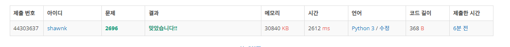

# BAEKJOON 1696 중앙값 구하기

### [🏸문제](https://www.acmicpc.net/problem/1696) 

<hr>


### 💊풀이

> 입출력을 주어진 방식대로 진행하며 특정 범위의 배열을 만들고 정렬하자

1. 10개씩 끊어서 입력을 받는다.
1. 받은 입력값을 step을 2씩 건너뛰며 배열을 가져오고 정렬 후 중앙값을 찾는다.
1. 위에서 찾은 중앙값을 리스트에 담아놓고 10개씩 끊어서 출력한다.

<hr>

### 📌코드

```python
import sys
sys.stdin = open('input.txt')

T = int(input())

for _ in range(T):

    size = int(input())
    print(size//2+1)

    arr = []
    for j in range(size//10+1):                     # 10개가 넘어가는 input 값 받기 (10개씩 잘라서)
        arr.extend(list(map(int,input().split())))

    value = []
    for i in range(0,size,2):                       # step을 2씩 주면서 배열의 해당 범위만 정렬 후 가운데 값 뽑기
        temp = sorted(arr[0:i+1])
        value.append(temp[i//2])

    for i in range(len(value)//10+1):               # 10개씩 끊어서 출력하기
        print(*value[i*10:i*10+10])

```

<hr>


### 🛀결과



계속 정렬을 해가면서 푸는 방식이 매우 비효율적이라고 생각이 들어 처음에는 이렇게 풀기 싫었다. 하지만 문제를 푸는 것이 먼저라고 생각해서 이렇게 풀어보고 시간이 너무 오래걸린다면 다른 방법을 찾으려고 했다. 

문제는 잘 풀렸지만 시간이 상당히 오래 걸린 풀이이다.

heap을 이용해서 문제를 풀면 훨씬 빠르게 풀 수 있을 것이다.
