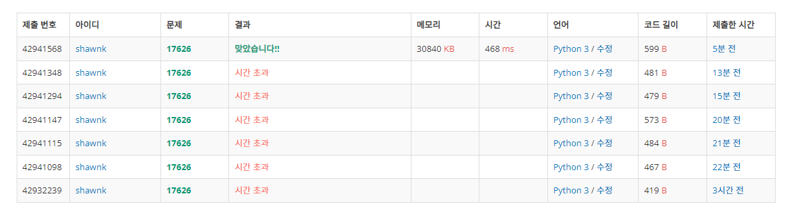

# BAEKJOON 17626 Four Squares

### [🏸문제](https://www.acmicpc.net/problem/17626) 

<hr>


### 💊풀이

> 4개의 포인터로 배열을 순회하자

1. input의 크기 보다 큰 값이 나오기 전까지 i**2를 배열에 추가
1. 위에서 만든 배열을 4중 for 문으로 순회하며 4개의 포인터 합이 N과 같다면 종료
1. 만약 첫 번째 for 문의 i 값이 1로 변하는 순간 4개의 숫자가 필요한게 확정됨으로 for 종료

<hr>

### 📌코드

```python
import sys
sys.stdin = open('input.txt')

def get_result(N):
    global arr
    length = len(arr)

    for i in range(length):
        for j in range(i,length):
            for q in range(j, length):
                for p in range(q, length):
                    if i >= 1:                              # pointer 4개를 돌면서 i가 1보다 크면 더 확인할 필요 없이 4개가 필요
                        return 4
                    if arr[p]+arr[q]+arr[j]+arr[i] == N:    # pointer 4개의 합이 N과 같으면 해당 포인터 출력
                        return (p,q,j,i)

N = int(input())

arr = []
i = 0
while i**2<=N:                                              # N보다 큰 값이 나오기 전까지 i**2를 리스트에 추가
    arr.append(i**2)
    i+=1

result = get_result(N)

if result ==4 :
    print(4)
else:
    cnt = 0
    for i in result:
        if i != 0:
            cnt+=1
    print(cnt)
```

<hr>


### 🛀결과



으으... 어려웠다.. 정답율이 45퍼 정도로 높은 문제여서 만만하게 보고 도전했다가 많이 혼났다. (알고보니 python 정답율은 20퍼대...) 처음에 그냥 input 까지의 수를 4중 for 문으로 돌았을 때 시간초과가 발생하여 i**2가 input 보다 커지기 전까지의 숫자들을 리스트로 만들어놓고 해당 리스트를 순회하기는 방법으로 바꾸었다. 그럼에도 시간 초과를 잡을 수 있어서 첫 번째 for 문의 i가 1로 변경 되는 순간 종료시키며 가지를 쳤더니 성공했다. 야호!

다른 사람들의 풀이를 봤더니 나처럼 무식하게 4중 for 문을 쓴 사람은 없는 것 같다... *~~(사실 나도 풀면서 성공할 줄 몰랐다..이게 되네? ㅋ)~~* 다른 풀이를 봐도 이해가 잘 안되는데 조금더 공부해 보겠습니다!
