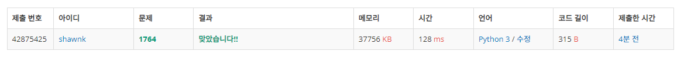

# BAEKJOON 1764 듣보잡

### [🏸문제](https://www.acmicpc.net/problem/1764) 

<hr>


### 💊풀이

> 처음 input을 dictionary로 받아서 해당 값을 다시 확인할 때 빠르게 확인 가능하게 하자

1. N까지의 input을 key로 하는 dictoinary 생성
1. N+1:M 의 input이 dictionary key에 존재하는지 확인
1. key에 존재한다면 arr 리스트에 추가

<hr>

### 📌코드

```python
 import sys
sys.stdin = open('input.txt')

N, M = map(int, input().split())

dic = {}
for _ in range(N):                          # N 까지의 input을 key로 dictionary에 담음
    value = sys.stdin.readline().rstrip()
    dic[value] = 1

arr = []
for _ in range(M):                          # N+1:M 까지의 input이 dictionary의 key에 존재하면 arr에 추가
    value = sys.stdin.readline().rstrip()
    if value in dic.keys():
        arr.append(value)

arr.sort()                                  # arr를 정렬 후 개수와 value를 순차적으로 출력

print(len(arr))
for i in arr:
    print(i)
```

<hr>


### 🛀결과



쉬운 문제여서 오히려 내가 너무 간단하게 생각하고 있나 오해했다. 이는 내가 시간 복잡도를 대략적으로라도 계산해보고 풀지 않았기 때문이다. 내 접근 방식이 어느 정도의 시간 복잡도를 가질지 생각해보면 현재 풀이가 올바른 접근인지 아닌지를 판단할 수 있는데 그렇지 않았기에 이렇게 하면 시간 초과가 나오려나? 라는 고민이 들었던 것 같다. *~~(시간 복잡도 고민은 다음 문제부터..히히)~~*
