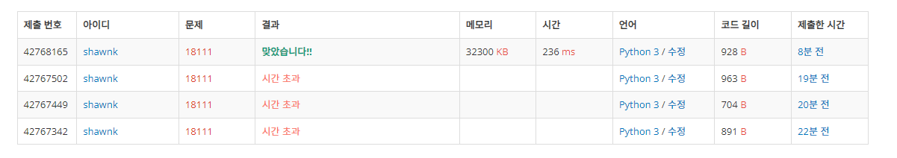

# BAEKJOON 18111  마인크래프트

### [🏸문제](https://www.acmicpc.net/problem/18111) 

<hr>


### 💊풀이

> 순회 범위를 미리 설정하고 2차원 배열을 1차원 배열로 변환하여 문제를 풀자

1. 들어올 input의 최대 범위만큼 배열을 1차원 배열을 생성
1. input을 2차원 배열로 받고 min,max 값을 구하고 input의 값을 idx로 하는 1차원 배열에 count 해준다
1. min~max 범위를 순회하면서 1차원 배열의 idx와 비교해서 블록을 추가 또는 제거 해주며 시간과 높이를 갱신

<hr>

### 📌코드

```python
import sys
sys.stdin = open('input.txt')

N, M, B = map(int, input().split())

arr = [list(map(int,sys.stdin.readline().strip().split())) for _ in range(N)]
temp = [0] * 257                # 2차원 배열인 input을 1차원 배열로 변환해주기 위해 1차원 배열 초기화

mmin = 257                      # input의 최소값 받아오기
mmax = 0                        # input의 최대값 받아오기

for i in range(N):
    for j in range(M):
        temp[arr[i][j]] += 1    # temp 배열에 input의 값을 idx로 해서 value를 +1
        if arr[i][j] > mmax:
            mmax = arr[i][j]
        if arr[i][j] < mmin:
            mmin = arr[i][j]


result = 1000000000              # 나올 수 없는 높은 시간으로 result 초기화
height = -1                      # 나올 수 없는 낮은 높이로 height 초기화

for num in range(mmin, mmax+1):
    cnt = 0
    cnt_B = B
    for i in range(257):
        if cnt > result:
            continue

        if i > num:
            cnt += (i-num)*temp[i]*2            # idx가 num 보다 크면 블록을 빼주고 해당 idx의 value의 크기만큼 곱하고 다시 *2 해서 시간을 구해줌
            cnt_B += (i - num)*temp[i]          # 위와 같이 인벤토리 블록 수를 추가
        elif i < num:
            cnt_B -= (num - i) * temp[i]        # idx가 num 보다 작으면 블록을 빼주고 해당 idx의 value의 크기만큼 곱해서 인벤토리 블록 수를 빼줌
            cnt += (num - i) * temp[i]          # 위와 같이 계산해서 걸리는 시간을 더해줌

    if cnt_B < 0:                               # 위 작업이 다 끝났을 때 인벤토리 블록 수가 - 라면 더이상 진행하지 않고 다음으로 순회로 넘어감
        continue
    else:
        if cnt < result:                        # 걸린 시간이 기존보다 적게 걸렸다면 높이와 시간을 새로 갱신해줌
            height = num
            result = cnt
        elif cnt == result and num > height:    # 걸린 시간이 같고 높이는 더 높다면 높이만 새로 갱신해줌
            height = num
print(result, height)
```

<hr>


### 🛀결과



오랜만에 난이도가 어느정도 있는 문제를 풀었더니 쉽게 풀리지 않았다.

2차원 배열로 input을 받고 그 상태로 문제를 풀려고 했더니 시간 초과를 벗어날 수가 없었다. 따라서 2차원 배열을 어떻게 하면 1차원 배열로 바꿀 수 있을까를 고민했다. 블록의 수만 세주면 되기 때문에 블록의 높이를 idx로 하는 1차원 배열을 만들고 해당 높이의 블록이 몇 개 있는지를 찾았다. 그리고 블록 높이의 min과 max를 구해서 해당 범위 내에서 순회하며 블록 높이와 비교해주며 블록을 추가 또는 제거하며 시간과 높이를 갱신하면 답을 구할 수 있다. *~~(오예!)~~*
