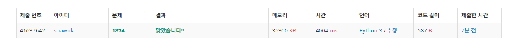

# BAEKJOON 1874	스택 수열

### 문제 

https://www.acmicpc.net/problem/1874

<hr>


### 풀이

주어지는 input의 범위가 굉장히 크기 때문에 재귀 호출을 통해서 포함 또는 불포함 여부로 구해내는 것은 시간 초과가 발생할 가능성이 굉장히 높다.

따라서 그리드한 방식으로 하나씩 추가해가며 주어진 수와 비교하고 하나씩 stack에서 값을 빼며 주어진 값과 비교하는 방식이 효율적이라고 생각했다.

<hr>


### 코드

```python
import sys
sys.stdin = open('input.txt')
N = int(input())

lst = []
for _ in range(N):
    lst.append(int(input()))

cnt = 0                         # 숫자가 몇까지 들어갔는지 기록
result = []                     # 연산자를 담을 리스트
stack =[]                       # 실제 수를 담을 리스트
flag =1                         # 만약 수열을 완성할 수 없으면 flag를 -1로 바꾸어줌
for i in lst:
    if flag==-1:                # 수열을 완성할 수 없으면 반복 종료
        break
    if i > cnt:                 # 주어진 리스트의 값이 cnt 보다 크면
        while i != cnt:         # 리스트의 값과 cnt 가 같을 때까지 push 해주면서 cnt를 +1 해줌
            cnt+=1
            result +=['+']
            stack.append(cnt)
        stack.pop()             # cnt와 리스트의 값이 같으면 stack에서 pop해줌
        result+=['-']
    elif i < cnt:               # 만약 cnt보다 현재 리스트의 값이 작다면
        while True:             # stack의 pop 값이 리스트의 값과 같을 때가지 계속해서 pop
            result+=['-']
            if len(stack)==0:   # stack 의 크기가 0인데 아직도 리스트의 값과 같은게 나오지 않았다면
                flag = -1       # 수열을 완성할 수 없음으로 flag를 -1로 바꾸고 함수 종료
                break
            if stack.pop() == i:
                break
if flag == 1:
    for i in result:
        print(i)
else:
    print('NO')
```

<hr>


### 결과



제출은 한 번에 통과했지만 시간이 아슬아슬 했다. 실제 코드 채점 시간이 상당히 오래걸려서 틀렸구나 생각했다.

통과 시간이 빠른 사람의 코드를 보니 접근 방식은 크게 다르지 않았다. 하지만 구현에서 문제가 있었던 것 같다.

어디가 문제인지는 코드를 조금더 뜯어보아야 할 것 같다.