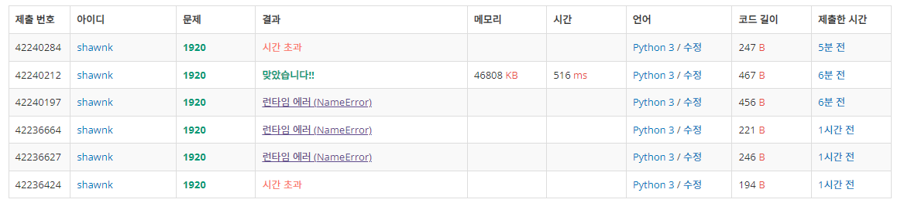

# BAEKJOON 1920 수 찾기

### [🏸문제](https://www.acmicpc.net/problem/1920) 

<hr>


### 💊풀이

> 주어진 입력값이 굉장히 크기 때문에 이진 탐색으로 접근해야 한다.

1. 0과 N-1 을 이진 탐색 최소 최대 범위로 지정
2. 이진탐색을 수행하며 값을 발견했을 때와 발견하지 못했을 때에 따라 출력을 다르게 해준다.


### 📌코드

```python
import sys
sys.stdin = open('input.txt')
input = sys.stdin.readline

def bi_search(value):               # 이진 탐색
    min = 0                         # 시작 idx
    max = N-1                       # 마지막 idx
    while min <= max:               # min 값이 max 를 초과하면 stop
        mid = (max + min) // 2      # mid 는 max+min을 2로 나눈 값
        if arr_N[mid] > value:      # 찾는 값이 배열의 중간 값보다 작다면 max의 값을 mid-1로 끌어옴
            max = mid-1
        elif arr_N[mid] < value:    # 찾는 값이 배열의 중간 값보다 크다면 min의 값을 mid+1로 끌어옴
            min = mid+1
        else:
            return 1                # 값을 찾았다면 1을 반환
    return 0                        # 값을 못찾았다면 0을 반환


N = int(input())
arr_N = list(map(int, input().split()))
arr_N.sort()

M = int(input())
arr_M = list(map(int, input().split()))

for i in arr_M:
    print(bi_search(i))
```

<hr>


### 🛀결과



파이써닉하게 풀 수 있는지 도전해보았었다. in 을 사용해서 안에 숫자가 있으면 1 없으면 0을 출력하도록 했는데 이렇게 접근하면 전체 범위를 다 순회해야 해서 시간 초과가 발생하는 것 같다. 따라서 해당 문제는 이진 탐색을 통해 접근해야 한다.