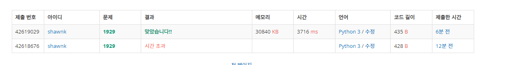

# BAEKJOON 1929 소수 구하기

### [🏸문제](https://www.acmicpc.net/problem/1929) 

<hr>


### 💊풀이

> 범위를 value ** 0.5 (루트)  까지만 순회하면서 찾아본다.

1. input 을 받아서 1이면 소수 아니고, 2 이상부터 소수 찾기 시작

1. 범위를 value ** 0.5 까지 순회하여 순회 범위를 최대한 줄여준다.

1. 위에서 만든 범위까지 수로 value를 나누어 주면서 소수인지 판단

   

<hr>

### 📌코드

```python
import sys
sys.stdin = open('input.txt')

N, M = map(int,input().split())

def check_1(value):
    if value == 1:                  # input이 1이면 소수가 아님
        return 0
    else:
        for i in range(2,int(value**0.5)+1):    # input이 2 이상일 때는 value**0.5 까지 순회하면서 소수가 있는지 찾는다.
            if value%i == 0:
                return
    return value


for i in range(N,M+1):
    value = check_1(i)
    if value:
        print(value)


```

<hr>


### 🛀결과



지난 [소수 찾기 문제](https://velog.io/@shawnk123/BAEKJOON-1978-%EC%86%8C%EC%88%98-%EC%B0%BE%EA%B8%B0) 문제처럼 접근하였더니 시간 초과가 나타났다. 때문에 최대한 탐색 범위를 줄이는 방법이 필요했고 루트를 씌워서 처리해도 문제가 없다는 사실을 알게 되었다. 야호!
