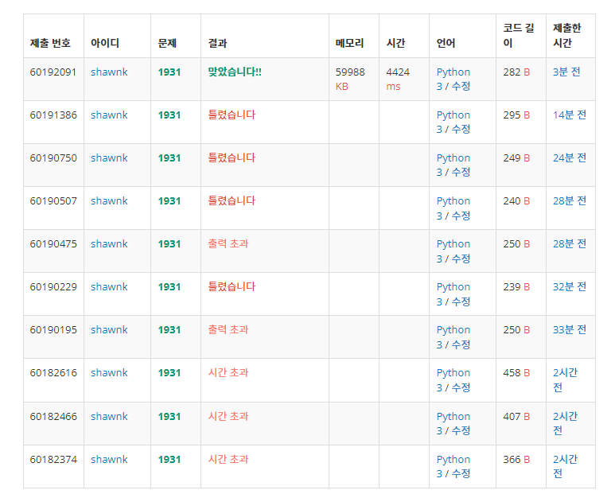

# BAEKJOON 1931 회의실 배

### [🏸문제](https://www.acmicpc.net/problem/1931) 

<hr>


### 💊풀이

> 주어진 인풋을 받아와서 회의 종료 시간을 기준으로 정렬

1. 인풋을 받고 종료 시간을 기준으로 정렬
1. 회의 종료 시간보다 늦게 시작하는 회의가 존재하면 count 
1. 회의 종료 시간을 다시 업데이트

<hr>

### 📌코드

```python
import sys
sys.stdin = open('input.txt')

N = int(input())

arr = [list(map(int, input().split())) for _ in range(N)]
arr = sorted(arr, key=lambda n:(n[1], n[0]))

cnt = 1

start = arr[0]
if start[0]==start[1]:
    cnt-=1
for meeting in arr:
    if meeting[0] >= start[1]:
        cnt += 1
        start = meeting
print(cnt)
```

<hr>


### 🛀결과



실수를 많이 한 문제다.

처음에 시작 시간을 기준으로 정렬하여 풀려고 하였으나, 끝나는 시간을 기준으로 정렬하여 풀어야 훨신 더 쉽게 풀 수 있다는 사실을 늦게 깨달았다. 또한 배열의 첫 번째를 start로 이미 잡아놓고 시작하였느데 회의 시간을 비교할 때 배열을 다시 처음부터 순회하는 실수를 했다. 해결은 첫 회의에서 시간 시간과 종료 시간이 같으면 전체 카운트에서 1을 빼주는 식으로 했으나 배열을 idx 1 부터 순회하게 했으면 훨씬 깔끔하게 통과했을 것 같다.
