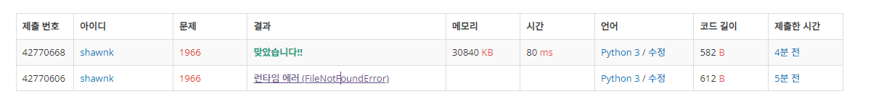

# BAEKJOON 1966 프린터 큐

### [🏸문제](https://www.acmicpc.net/problem/1966) 

<hr>


### 💊풀이

> 찾는 수의 현재 idx가 0인지 아닌지를 구분해서 접근한다.

1. 찾는 수의 idx가 0이라면
   * pop(0)가 최댓값이면 count를 +=1 하고 종료
   * 최댓값이 아니면 제일 뒤로 보내고 idx를 배열 크기 -1 로 갱신
1. 찾는 수의 idx가 0이 아니라면
   * idx를 앞으로 한 칸 당겨놓고 시작
   * pop(0) 가 최댓값이 아니라면 빼서 배열의 제일 뒤로 보냄
   * pop(0) 가 최댓값이라면 빼서 없애주고 count를 += 1

<hr>

### 📌코드

```python
import sys
sys.stdin = open('input.txt')

T = int(input())
for _ in range(T):
    N, idx = map(int, sys.stdin.readline().rstrip().split())
    arr = list(map(int, sys.stdin.readline().rstrip().split()))

    i = 0
    while True:
        if idx == 0:                        # 원하는 값의 idx가 0일 때
            if arr[0] != max(arr):          # 값이 최대가 아니면 맨 뒤로 보내고 idx를 제일 마지막으로 갱신
                arr.append(arr.pop(0))
                idx = len(arr) - 1
            else:                           # 만약 원하는 값이 최대값이면 횟수를 카운팅하고 종료
                i += 1
                break
        else:                               # 원하는 값의 idx가 0이 아닐 때는
            idx -= 1                        # idx를 하나 앞으로 당겨주고
            if arr[0] != max(arr):          # 제일 앞의 수가 최대값이 아니면
                arr.append(arr.pop(0))      # 빼서 제일 뒤로 보내줌
            else:                           # 제일 앞의 수가 최대값이면 빼고 횟수를 카운팅
                arr.pop(0)
                i += 1
    print(i)                                # 원하는 수가 pop됐을 때 현재까지 몇 번의 출력이 있었는데 카운팅한 값을 출력
```

<hr>


### 🛀결과



찾는 수의 idx가 0인지 즉, 현재 출력 위치에 있는지를 확인하면서 찾는 수의 위치가 이동할 때마다 맞춰서 idx를 갱신해주면 된다. 계속해서 갱신해주다 idx가 다시 0으로 왔을 때 최댓값인지 검증 이 작업을 계속해서 반복해주면 쉽게 해결*~~(class2 격파 성공햇쥬!)~~*
