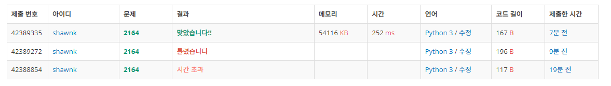

# BAEKJOON 2164 카드2

### [🏸문제](https://www.acmicpc.net/problem/2164) 

<hr>


### 💊풀이

> 포인터를 사용하여 문제에 접근한다.

1. front와 rear 변수 생성 (front : 현재 내가 바라보고 있는 값의 위치, rear : 배열의 마지막 값의 위치)
1. 숫자를 삭제할 때 front += 1
1. 숫자를 뒤로 보낼 때 front+=1, rear+=1

<hr>

### 📌코드

```python
N = int(input())

arr = list(range(1,N+1))
                            # 시간 초과 해결을 위해 pointer 사용
rear = N-1                  # 값의 마지막 부분
front = 0                   # 값의 시작 부분
while rear!=front:          # front가 rear를 따라잡으면 종료
    front += 1              # front +=1 (처음 원소의 삭제를 의미)
    arr.append(arr[front])  # front가 가리키는 값을 배열의 맨 뒤에 추가(리스트의 맨뒤에 추가하는 경우 시간 복잡도는 굉장히 낮다(O(1))
    rear+=1                 # 배열의 크기가 늘어났으니 rear도 그만큼 한칸 후퇴
    front += 1              # 뒤로 보낸 위치는 다시 취급하지 않기 위해 front를 1만큼 전진
print(arr[-1])
```

<hr>


### 🛀결과



처음에 시간 복잡도를 완벽하게 계산하지 못했어서 완전 탐색을 진행해도 될 줄 알았다. 하지만 배열에서 pop(0)는 O(len(배열)) 만큼의 시간이 걸리고 이것을 계속해서 반복하게 되기 때문에 제한 시간을 초과하게 된다. 따라서 바로 pointer를 사용한 접근으로 방식을 바꾸었다. 결과는 **대성공!**

헷
