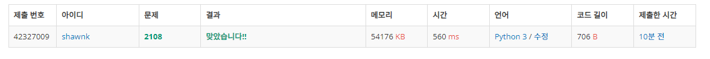

# BAEKJOON 2108 통계학

### [🏸문제](https://www.acmicpc.net/problem/2108) 

<hr>


### 💊풀이

> 카운팅 정렬을 통해 최빈값 및 각 문제를 해결한다.

1. 수들의 범위를 확인
2. 음수의 범위를 양수의 범위로 바꾸어줄 수 있도록 값에 + 해준다.
3. 모든 수가 양수의 범위로 바뀐다면 카운팅 정렬을 진행한다.
4. 최대 개수를 가지고 있는 idx들을 구하고 조건에 맞추어 출력

<hr>

### 📌코드

```python
import sys
sys.stdin = open('input.txt')
input = sys.stdin.readline

N = int(input())

arr = [0]*8001              # 주어진 input의 갯수를 담을 리스트 생성 ( input이 음수도 존재함으로 4000 더해줘서 음수를 양수 범위로 바꾸어줌)
data =[]                    # 주어진 input의 값을 담은 빈리스트 생성
result = [0] * N            # 정렬된 값을 담을 리스트 생성

for _ in range(N):
    value=int(input())
    arr[value+4000]+= 1     # input의 갯수 카운팅
    data.append(value)

mmax=max(arr)
temp=[]
for i in range(len(arr)):   # 최댓값의 idx 구하기
    if arr[i]==mmax:
        temp.append(i)

for i in range(len(arr)-1):     # 누적합 구하기
    arr[i+1] = arr[i]+arr[i+1]

for i in data:                  # 카운팅 정렬
    result[arr[i+4000]-1]=i
    arr[i+4000]-=1

def solv_1():
    return round(sum(result)/N)

def solv_2():
    return result[N//2]

def solv_3():
    if len(temp) == 1:
        return temp[0]-4000
    else:
        return temp[1]-4000

def solv_4():
    return result[N-1]-result[0]

print(solv_1())
print(solv_2())
print(solv_3())
print(solv_4())
```

<hr>


### 🛀결과



처음에는 단순하게 정렬 하고 문제를 풀려고 했더니 최빈값 부분에서 해결이 어려워졌다. 따라서 카운팅 정렬을 통해 각 수들의 빈도수를 구하고 이를 통해 문제를 해결했다. 오랜만에 카운팅 정렬을 구현해보니 너무 어려웠고 막히는 부분도 많았다. 옆에서 도와주지 않았다면 절대 구현하지 못했을 수도 있다...(반성ㅜ) 

기존에 공부했던 알고리즘들을 다시 복습해보자!!!
