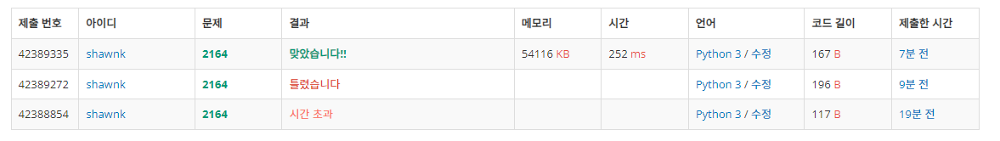

# BAEKJOON 2164 카드2

### [🏸문제](https://www.acmicpc.net/problem/2164) 

<hr>


### 💊풀이

> 포인터를 사용하여 문제에 접근한다.

1. front와 rear 변수 생성 (front : 현재 내가 바라보고 있는 값의 위치, rear : 배열의 마지막 값의 위치)
1. 숫자를 삭제할 때 front += 1
1. 숫자를 뒤로 보낼 때 front+=1, rear+=1

<hr>

### 📌코드

```python
import sys
sys.stdin = open('input.txt')
input = sys.stdin.readline


N = int(input())
arr = [[] for _ in range(200001)]       # 미리 x좌표 만큼의 배열 생성

for _ in range(N):
    x, y = map(int, input().split())
    arr[x+100000].append(y)             # 음수를 제거해주기 위해 음수 최대 범위 만큼을 더해줌

for i in range(200001):
    if len(arr[i])>0:
        for j in sorted(arr[i]):        # 해당 idx에 값이 존재하면 정렬해서 순차적으로 뽑아낸다.
            print(f'{i-100000} {j}')

```

<hr>


### 🛀결과



처음에 시간 복잡도를 완벽하게 계산하지 못했어서 완전 탐색을 진행해도 될 줄 알았다. 하지만 배열에서 pop(0)는 O(len(배열)) 만큼의 시간이 걸리고 이것을 계속해서 반복하게 되기 때문에 제한 시간을 초과하게 된다. 따라서 바로 pointer를 사용한 접근으로 방식을 바꾸었다. 결과는 **대성공!**

헷
