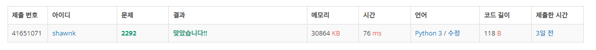

# BAEKJOON 2292 벌집

### 문제 

https://www.acmicpc.net/problem/2292

<hr>


### 풀이

벌집 문제는 그림만 보아도 알 수 있듯이 수열을 찾는 문제이다.

수의 범위가 어떤 형태로 커져가는지 점화식을 찾아내는 것이 이 문제를 해결하는 포인트이다.

시작값을 1로 설정하고 다음 범위의 최댓값은 현재 base에서 i번째 수를 6만큼 곱해서 더해주면 된다.

<hr>


### 코드

```python
N = int(input())
base = 1                # 시작값을 1로 설정
i = 0                   # i번 째의 최대 범위를 찾자
while True:
    base = base + 6*i   # i번의 최대 범위는 기존 base에서 6*현재 i의 수
    i += 1              # 다음 차례로 넘어갈 때 i를 +1 해준다
    if N <= base:       # 찾는 수 N이 최대 범위 base보다 작다면 스탑
        break

print(i)-
```

<hr>


### 결과



수열, 수학 문제가 항상 어렵게만 느껴진다. 위 문제는 기초적인 수준이라 쉽게 해결했지만 조금만 어려운 수열, 수학 문제를 만나면 항상 어질어질해지는 것 같다.

역시 답은 많은 문제를 풀어보는 것... 노력하자!