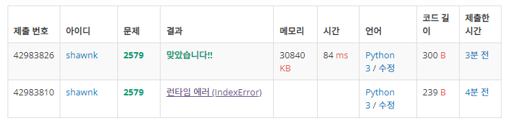

# BAEKJOON 1463 1로 만들기

### [🏸문제](https://www.acmicpc.net/problem/1463) 

<hr>


### 💊풀이

> dp를 사용하여 이전 값들을 활용하자

1. 0:3 까지 기저 조건 초기화
1. idx 3 앞까지와 idx 2 앞까지를 나누어서 계산하자
1. 조건에 따라 맞추어 출력

<hr>

### 📌코드

```python
import sys
sys.stdin = open('input.txt')

N = int(input())
arr = []
for _ in range(N):
    arr.append(int(input()))

if N != 1:                                                      # N이 1이면 바로 input 출력
    dp = [0] *(N+1)
    dp[1] = arr[0]                                              # 기저조건 0:3 초기화
    dp[2] = arr[0]+arr[1]

    for i in range(3, len(arr)+1):                              # 3번 째 앞에까지 최대값에 2번 앞의 값 더한 값과 2번째 앞까지 최댓값 중 큰 값에 현재 값을 더해준다.
        dp[i] = max(dp[i-3]+arr[i-2], dp[i-2]) + arr[i-1]
    print(dp[-1])
else:
    print(arr[-1])
```

<hr>


### 🛀결과



정말 간단해 보이는 코드이지만 이 방법을 생각하는데 2시간이나 걸렸다... dp 문제는 항상 풀어도 풀어도 어려운 것 같다.

지난번과 마찬가지로 출력시 1일 때오 아닐 때를 나누어서 출력하는 방법 말고 어떻게 할 수 있을지를 잘 모르겠다. 위와 같은 방식으로 출력하는 것은 보기에 딱히 좋아보이지 않다...

class3에 들어오니 dp가 갑자기 늘어났다. 더 열심히 해서 다음 dp는 빠른 시간 내에 후다닥 풀어버려야지!
