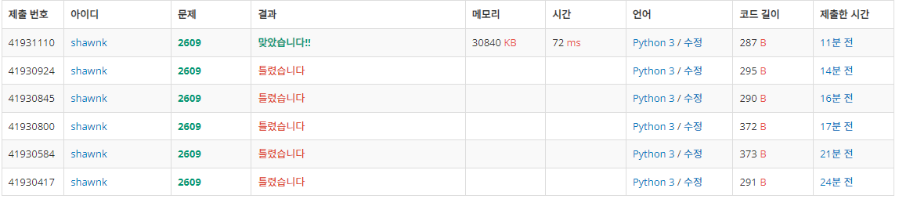

# BAEKJOON 2609 최대공약수와 최소공배수

### 🏸문제 

https://www.acmicpc.net/problem/2609

<hr>


### 💊풀이

최소 공배수와 최대 공약수를 구하는 문제이다

1. 그리드한 방법으로 주어진 수 중에 작은 수 범위까지 2부터 순회한다.
2. 나눌 수 있으면 나눌 수 있는 수를 리스트에 담아두고 나누어진 몫들로 다시 처음부터 반복한다.
3. 나눌 수 있는 수가 존재하지 않으면 반복을 종료 후 결과를  출력

유클리드 호제법을 이용한 풀이

1. 최대 공약수 구하기

```
최대 공약수 : 큰 값을 작은 값으로 나눈 나머지로 작은 값을 계속해서 나눠가다 나머지가 0이 나왔을 때 작은 값

N,M 이 다음과 같다고 가정해보자
N=36
M=15
N%M = 6 이 될 것이다
이 때 M(15)과 6을 가지고 위와 같은 작업을 반복한다.
15%6 = 3 이 된다.
이후 6%3=0 이므로 반복을 종료하고 3이 최대 공약수가 된다.

이 때 규칙을 보면 N%M 한 결과는 결국 최대 공약수의 배수가 된다는 사실을 알 수 있다. (6,3)
따라서 N%M을 계속 진행해서 나오는 나머지는 결국 모두 같은 최대 공약수를 공유한다는 사실을 발견할 수 있다.
따라서 나눈 나머지가 0일 때까지 진행하면 가장 마지막에는 최대 공약수 본인의 배수이므로 마지막 수가 최대 공약수가 된다.
```

2. 최대 공배수 구하기

```
위에서 구한 최대 공약수를 이용하여 최소 공배수를 구해보도록 하자
M, N을 다음과 같이 정의하자
M = Gx, N=Gy (G는 최대 공약수)

위에서 정의 M=36, N=15를 통해 살펴보면
36 = 3*x, 15=3*y 가 된다.

수식을 풀어가면
36*15 = 3^2*x*y
36*15/3=3*x*y

따라서 최소 공배수는 M*M*G가 된다.
```


<hr>


### 📌코드

```python
import sys
sys.stdin = open('input.txt')

Q = [list(map(int,input().split()))]    # input을 list형태로 받는다

temp = []                               # 나눌 수 있는 수를 저장할 빈 list 초기화
while Q:
    n, m = Q.pop()                      # 처음에 받은 list에서 값을 꺼내서 n,m에 담아주기
    for i in range(2,min(m,n)+1):       # 주어진 값 중 작은 숫자를 마지막 범위로 해서 2부터 순회
        if n%i==0 and m%i==0:           # n,m 둘 다 나눌 수 있는 수가 나타나면
            temp.append(i)              # 나눌 수 있는 수의 모임 temp에 저장 후
            Q.append([n//i,m//i])       # 나눴을 때 몫을 list에 새로 담아주고 순회 종료
            break                       # Q 가 빌 때까지 계속해서 반복
cnt_1 = 1                               # cnt_1 변수를 1로 초기화
for i in temp:                          # 나눌 수 있는 수들의 곱 : 최대 공약수
    cnt_1*=i
print(cnt_1)
print(cnt_1*n*m)                        # 최대 공약수 * 마지막 n,m의 몫 : 최소 공배수


def get_gcd(mmax,mmin):                 # 유클리드 호제법
    temp = mmax%mmin                    # 큰 수를 작은 수로 나눈 나머지를 temp에 담음
    if temp ==0:                        # temp가 0 이면 이때 mmin이 최대 공약수
        return mmin
    return get_gcd(mmin,temp)           # temp가 0이 아니면 mmax에 mmin을 mmin에 temp를 넣고 다시 함수 호출

n, m  =map(int, input().split())
cnt1 = get_gcd(max(n,m), min(m,n))      
cnt2 = n*m//cnt1                        # 최소 공배수 = n*m/G
print(cnt1)
print(cnt2)
```

<hr>


### 🛀결과



마에 씌였는지 처음 시도를 2,3,5,7 네 숫자로만 나누어보면 된다고 착각하였다;;;

당연히 실패하였고 이후에 수를 전부 순회하도록 바꾸다가 시간이 너무 오래걸릴 것 같아 작은 수의 n//2 까지만 순회하도록 했는데 생각해보니 작은 수 자체가 최대 공약수인 경우도 존재하였다. 따라 결국은 작은 수를 기준으로 전체 수를 순회하도록 하는 방식으로 변경해주었다.

시간이 엄청 오래걸릴 줄 알았는데 그리 오래 걸리지 않네?

다른 사람들의 코드를 보니 유클리드 호제법으로 푼 코드들이 있었다. 너무 옛날에 배웠던 것이라 아주 새까맣게 잊고 있었다. 

따라서 해당 부분도 다시 공부하여 정리하였다.