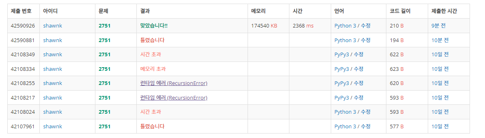

# BAEKJOON 2751 수 정렬하기 2

### [🏸문제](https://www.acmicpc.net/problem/2751)

<hr>


### 💊풀이

> 최대 양수 범위까지 미리 배열을 생성해서 담아주자

1. 음수 최대 범위만큼을 input에 더해줘서 모든 수를 양수로 변환
1. input의 값을 idx로 해서 배열 idx의 value += 1 
1. 배열에 value가 존재하는 idx만 idx+1000000으로 출력

<hr>


### 📌코드

```python
import sys
sys.stdin = open('input.txt')
input = sys.stdin.readline

N = int(input())

arr = [[] for _ in range(2000001)]  # 음수 최대 범위로 배열을 미리 생성
for _ in range(N):
    arr[int(input())+1000000] = 1   # 음수를 없애주기 위해 1000000을 더해줌

for i in range(2000001):            # 배열을 순회하면서 해당 idx에 값이 존재하면 idx 출력
    if arr[i]:
        print(i-1000000)            # idx-1000000 으로 출력
```

<hr>


### 🛀결과



처음에 퀵 정렬을 통해 문제를 해결하려고 했더니 계속 시간 초과가 발생하였다. 퀵 정렬은 최악의 경우(이미 수가 정렬되어 있다면) n^2로 input 최대 10000000개가 주어진다면 1000000^2 의 시간 복잡도를 가지게 된다...*~~(실화냐)~~* 따라서 먼저 배열을 생성 해놓고 해당 배열에 담아가는 식으로 확인하는 방법을 진행했더니 문제가 쉽게 풀렸다.!!!!!! 
