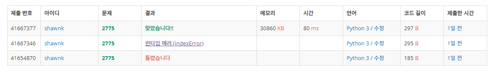

# BAEKJOON 2775 부녀회장이 될테야

### 문제 

https://www.acmicpc.net/problem/2775

<hr>


### 풀이

1. 첫 열을 전부 1로 초기화
1. 1,1 부터 마지막까지 순회하며 현재 idx의 앞 열과 윗 행을 더한 값을 현재 값으로 채워준다

<hr>


### 코드

```python
import sys
sys.stdin = open('input.txt')

arr = [[0] * 15 for _ in range(15)]
arr[0] = list(range(1,16))

for i in range(15):                             # 배열의 0 열을 전부 1로 초기화
    arr[i][0] =1
    
for i in range(1, 15):                          # 1,1 부터 순회하며 앞 열과 윗 행을 더한 값을 본인의 값으로 채워줌
    for j in range(1,15):
        arr[i][j] = arr[i-1][j]+arr[i][j-1]

T = int(input())


for tc in range(T):
    N = int(input())
    M = int(input())
    print(arr[N][M-1])

```

<hr>


### 결과

### 

처음에는 수열을 사용하여 문제를 해결하고 싶었다. 하지만 idx 2까지만 수열을 구할 수 있었고 더 늘어났을 경우 어떻게 식을 만들 수 있는지 식이 바뀌는 규칙성을 찾기 어려웠다. 그래서 결국에는 전체 배열을 만들어놓고 직접 하나씩 채워가는 방식으로 문제를 해결하였다. 수학 공부가 절실하다 ㅜㅜ
