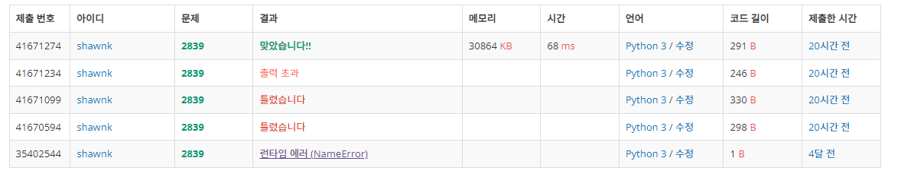

# BAEKJOON 2839 설탕 배달

### 문제 

https://www.acmicpc.net/problem/2839

<hr>


### 풀이

1. dp 배열 생성 및 초기화
2. 3의 배수 idx에 값 넣기
3. 5의 배수 idx 값 넣기
4. 현재 칸과 현재 -5번 째 칸+1 의 값 비교하면서 최소값으로 갱신

<hr>


### 코드

```python
N = int(input())
dp = [9999] *(N+1)                  # 나올 수 없는 큰 수로 dp 초기화
cnt3=1                              # 3의 배수의 idx에 초기값 설정
cnt5=1                              # 5의 배수의 idx에 초기값 설정
for i in range(1,N+1):
    if i%3 ==0:                     # 3의 배수 idx에 값 넣어주기
        dp[i]=cnt3
        cnt3+=1
    if i%5 ==0:                     # 5의 배수 idx에 값 넣어주기
        dp[i] = cnt5
        cnt5+=1

for i in range(3, N+1):             # 3뒤 부터 5칸 앞에에 1더한 것과 본인 중 더 작은 값으로 업데이트
    dp[i] = min(dp[i-5]+1,dp[i])

if dp[-1]==9999:
    print(-1)
else:
    print(dp[-1])

```

<hr>


### 결과

### 

dp를 사용해서 문제를 풀기 위해 노력했다. 아직 dp를 활용하여 문제를 푼다는 것이 익숙하지 않아 구현에 실패가 많았다. 여러가지 문제를 풀면서 dp를 구현하기 위해 노력해보자! 
