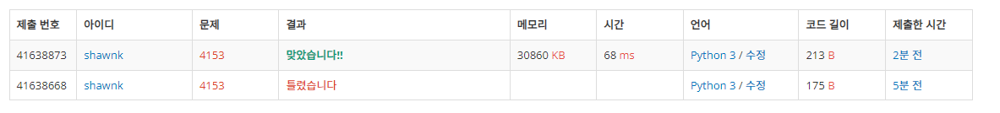

# BAEKJOON 4153 직각삼각형

### 문제 

https://www.acmicpc.net/problem/4153

<hr>


### 풀이

대각선을 굳이 찾지 않고 가장 큰 값을 찾아서 모든 수들의 제곱 합에서 가장 큰 수의 제곱을 뺀 것과 가장 큰 수의 제곱을 비교

<hr>


### 코드

```python
import sys
sys.stdin = open('input.txt')

while True:
    n1, n2, n3 = map(int, input().split())
    if n1+n2+n1 == 0:
        break
    if n1**2+n2**2+n3**2 - max(n1, n2, n3)**2==max(n1, n2, n3)**2:      # 주어진 세 수의 제곱의 합에 가장 큰 값의 제곱을 뺀 값이 가장 큰 값의 제곱과 같다면 지각 삼각형
        print('right')
    else:
        print('wrong')
```

<hr>


### 결과



테스트 케이스만 보고 혹시나 하면서 대각선의 위치가 고정된 위치로 주워지나 해서 그냥 해보았을 떄 실패하였다.

따라서 가장 큰 값을 고려해주어서 다시 접근하여 맞았다.