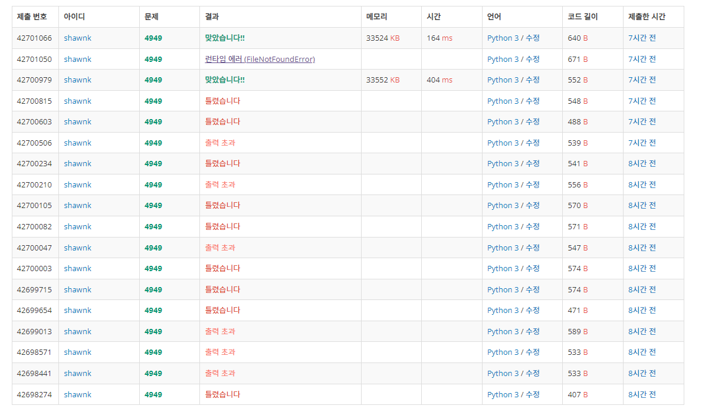

# BAEKJOON 11651	좌표 정렬하기2

### [🏸문제](https://www.acmicpc.net/problem/11651) 

<hr>


### 💊풀이

> readline을 활용하여 input을 받고 stack에 담아가면서 체크

1. sys.stdin.readline().rstrip() 으로 우측 공백을 제거하고 input을 받아온다.
2. 정규 표현식을 사용하여 괄호만 남기고 모든 문자를 제거한다.
3. 열린 괄호가 나오면 stack에 담는다.
4. 닫힌 괄호가 나왔을 때
   * 현재 stack이 비어있다면 no 출력
   * 닫힌 괄호의 짝이 맞지 않다면 no 출력
   * 위 확인이 전부 종료된 후 stack에 괄호가 남아있다면 no 출력
   * 그렇지 않다면 yes 출력

<hr>

### 📌코드

```python
import sys
import re
sys.stdin = open('input.txt')
text = sys.stdin.readline().rstrip()

dic = {
    '[':']',
    '(':')'
}

while text != '.' :                                 # input이 .이 나오면 종료
    stack = []
    text = re.sub('[^\\[\\]\\(\\)]','',text)        # [,],(,) 을 제외한 모든 문자 제거

    if len(text)%2:                                 # 문자열이 홀수면 괄호의 짝이 맞지 않기 때문에 다음 문자열을 받아 놓고 no 출력
        text = sys.stdin.readline().rstrip()
        print('no')
        continue

    for i in text:                                  # '(','[' 와 같이 열린 괄호면 stack에 추가
        if i == '(' or i == '[':
            stack.append(i)
        elif not stack or dic[stack.pop()] != i:    # 열린 괄호가 아닐 때 stack이 비어있거나 괄호 짝이 맞지 않다면 no 출력 후 다음 input 받기
            print('no')
            text = sys.stdin.readline().rstrip()
            break
    else:                                           # 위 검정 과정을 모두 통과했을 때 stack에 남은 괄호가 있다면 no 아니면 yes 출력
        if stack:
            print('no')
        else:
            print('yes')
        text = sys.stdin.readline().rstrip()
```

<hr>


### 🛀결과



정말 힘들었다...후... input을 sys.stdin.readline으로 받아왔을 때 문자열 마지막에 개행 문자가 포함되어 있는 경우가 존재해서 출력 초과가 발생하였다. 이를 방지하기 위해서는 sys.stdin.readline().rstrip()으로 우측의 개행 문자를 제거해주면 된다. 이것을 알지 못해서 엄청나게 돌아가고 고생했다... 허허...

또한 처음에는 열린 괄호는 + 닫힌 괄호는 - 방식으로 접근해보려다 포기하였고 두 번째로는 pointer를 만들어서 접근해보고 싶었다. 하지만 두 방법 모두 실패하고 시간을 많이 날렸다.*~~(내 멘탈도 함께 날아갔다...)~~* 
