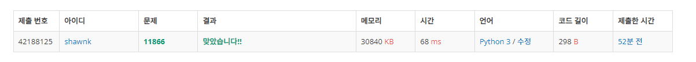

# BAEKJOON 11866 요세푸스 순열

### [🏸문제](https://www.acmicpc.net/problem/11866) 

<hr>


### 💊풀이

> **원형 Q의 성질을 이용해서 접근한다.**

1. 주어진 K-1 씩 idx를 이동하며 주어진 배열의 값을 제거
2. idx 값을 k-1 씩 계속 증가시키다 N 이상이면 N으로 나눈 나머지 (주어진 범위를 초과하지 않도록)
3. 배열의 값이 제거 될 때마다 크기를 1씩 감소 시킨다(N-1)
4. 위 작업을 더이상 배열에 원소가 남아있지 않을 때까지 반복!

<hr>


### 📌코드

```python
N, K = map(int,input().split())

arr = list(range(1,N+1))
value = K-1                                     # 배열이 1부터 시작하니까 idx 값은 K-1
print('<', end='')

while arr:
    if value >= N:                              # idx 가 배열의 크기 이상이라면 N으로 나눈 나머지
        value = value%N

    if len(arr)==1:                             # 현재 배열의 길이가 1이라면 print를 뒤에 , 없이 출력
        print(arr.pop(value%(N)),end='')
    else:
        print(arr.pop(value % (N)), end=', ')

    value += K-1                                # idx 크기 계속해서 추가
    N -= 1                                      # pop을 해서 배열에서 원소 1개를 제거했으니 길이 N을 1 줄여줌

print('>')
```

<hr>


### 🛀결과



순열 문제는 항상 볼 때마다 시간 초과라는 공포감이 밀려 온다... 다행히 주어진 수가 크지 않았기에 시간 초과가 날거라는 두려움은 크게 없었다. 주어진 범위 안에서 반복적으로 순회하는 문제를 여럿 보았기 때문에 접근 방법 자체를 고민하는 시간이 많지는 않았다. 다만 구현에 있어서는 어느정도 시간이 걸리긴 했다.

**여러 문제를 풀면서 내가 아는 것들은 최대한 빠르게 구현하는 능력이 필요하다!!**
