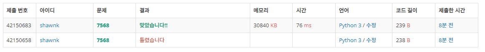

# BAEKJOON 7568 덩치

### 🏸문제 

https://www.acmicpc.net/problem/7568

<hr>


### 💊풀이

* 브루트 포스를 이용한 풀이

1. 초기값을 1로 설정해줌
2. 나보다 큰 값이 나오면 초기값에 +1을 해준다

<hr>


### 📌코드

```python
import sys
sys.stdin = open('input.txt')

N = int(input())

arr=[]
for _ in range(N):
    arr.append(list(map(int, input().split())))

result = []
for i in arr:
    k = 1                               # 초기값 1 설정
    for j in arr:
        if i[0] < j[0] and i[1] < j[1]: # 나보다 큰 값 존재할 때마다 1씩 더 추가
            k+=1
    result.append(k)
print(*result)
```

<hr>


### 🛀결과



전부 다 순회하면서 탐색하면 된다. 항상 문제를 보고 브루트 포스 방식으로 풀 수 있을 것 같은 문제들도 완전 탐색이 비효율적이라는 생각에 꺼려지곤 한다. 그렇기에 문제를 처음 봤을 때 주어지는 입력값의 크기, 메모리 사용량을 예상하여 계산하여 시간 복잡도와 공간 복잡도를 대략적으로 계산해 완전 탐색으로도 해결 가능한지를 따져보는 연습이 필요하다.

알고리즘 고수들이 말하기를 알고리즘 풀이에서 가장 중요한 것은 일단 해결하는 것이다. 일단 문제를 해결하고 시간 복잡도와 공간 복잡도를 개선하며 최적화 시키는 것은 두 번째이다. 

따라서 문제를 보고 처음부터 효율적인 접근을 고민하려는 것을 자제하자.

