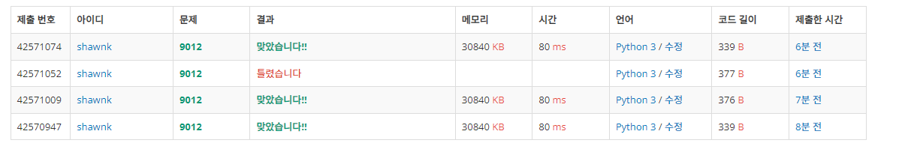

# BAEKJOON 9012 괄호

### [🏸문제](https://www.acmicpc.net/problem/9012) 

<hr>


### 💊풀이

> 괄호가  '(' 이면 +1 ,  ')'  이면 -1 

1. input 을 받아서 '(' 인지 ')' 인지 확인
1. '(' 가 없이 ')'가 들어오면 괄호 조건을 위반하니까 틀렷다.
1. 처리가 다 끝난후 '(' 가 남아있다면 조건 위반
1. '('가 들어오면 cnt += 1, ')' 가 들어오면 cnt -= 1 을 해주며 위 2,3 조건을 계속 만족하는지 확인

<hr>

### 📌코드

```python
import sys
sys.stdin = open('input.txt')

N = int(input())

def check(arr):
    cnt = 0                 # cnt 초기값 0으로 초기화
    for i in arr:           # input이 '(' 라면 cnt += 1
        if i == '(':
            cnt += 1
        else:               # input이 ')' 라면 cnt -= 1
            cnt -= 1
        if cnt < 0:         # cnt가 0보다 작아지면 '(' 보다 ')' 많다는 의미니까 NO
            return('NO')
            break
    if cnt != 0:            # 모든 input을 처리했을 때 cnt != 0 이면 아직 '('가 남았으니까 No
        return('NO')
    else:                   # cnt == 0 이면 모든 괄호가 처리됐음으로 YES
        return('YES')

for _ in range(N):
    arr = list(input())
    print(check(arr))
```

<hr>


### 🛀결과



input 값을 받으면서 포인터를 이동하듯이 cnt 값을 +와 -를 진행해주면 된다. 값을 하나 받고 연산 후 정상 괄호 조건을 위반하는지 체크해주면 간단하게 해결! *~~쉽쥬?~~*
