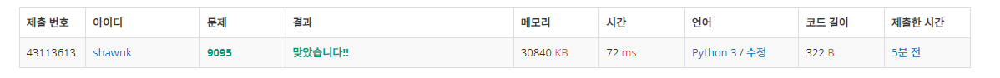

# BAEKJOON 9095 1, 2, 3 더하기

### [🏸문제](https://www.acmicpc.net/problem/9095) 

<hr>


### 💊풀이

> 중복 순열을 이용하여 문제 접근

1. [1, 2, 3] 배열 생성
1. 위 배열에서 중복을 허용해서 숫자를 뽑아서 뽑은 수를 arr에 담고 arr와 함께 다음 재귀 호출
1. 위 과정을 반복하다 arr에 담긴 수들의 합이 주어진 input 값과 같다면 cnt += 1 후 재귀 호출 종료, 만약 cnt를 초과해버렸다면 바로 재귀 호출 종료
1. 위 과정이 종료된 후 cnt를 출력한다.

<hr>

### 📌코드

```python
import sys
sys.stdin = open('input.txt')

def get_combi(nums, N, arr):            # 중복 순열을 이용해 문제를 풀자
    global cnt                          # 조건을 만족할 때 cnt += 1
    if sum(arr) > N:                    # 현재 담긴 수들의 합이 N을 초과했다면 함수 종료
        return

    if sum(arr) == N:                   # 현재 담긴 수들의 합이 N과 같다면 cnt += 1 후 함수 종료
        cnt += 1
        return
    for i in nums:                      # [1,2,3] 배열에서 하나씩 중복해서 빼오면서 재귀 함수 호출
        get_combi(nums, N, arr+[i])


N = int(input())
nums = [1,2,3]
for _ in range(N):
    cnt = 0
    get_combi(nums, int(input()), [])
    print(cnt)
```

<hr>


### 🛀결과



어떻게 문제를 풀 수 있을까 하다가 처음에는 1을 input의 크기만큼 늘어놓고 점화식을 찾아보려고 했다. 점화식을 찾으면 규칙을 통해 재귀 또는 dp로 문제를 해결 할 수 있을 거라고 생각했다. 

하지만 생각보다 쉽지 않았고 문제를 계속해서 읽다 보니 고등학교 때 공부했던 중복을 허용한 순열을 통해서 문제를 접근하면 쉽게 풀릴 것 같았다. 따라서 중복을 허용한 순열을 만들고 해당 수들의 합이 input과 같다면 cnt += 1을 해주도록 하였다. 

도중에 재귀의 깊이와, 시간 초과를 우려해서 수들의 합이 N을 초과할 때는 재귀 함수를 종료하도록 가지치기도 추가해주었다.

문제를 풀고 다른 사람들의 코드를 보니 거의 대부분이 dp 방식으로 문제를 풀었다.. 나는 실패했는데..ㅜㅜ 그래도 다르게 풀었다는 부분에서 또 기쁨이 있었다 ㅎㅎ

알고리즘 문제를 풀면서 항상 수학을 잘하면 문제를 정말 예쁘게, 잘 풀 수 있겠구나 라는 생각이 많이 든다. 열심히 수학도 공부하자*~~(라는 말만 몇 달 째..)~~*
