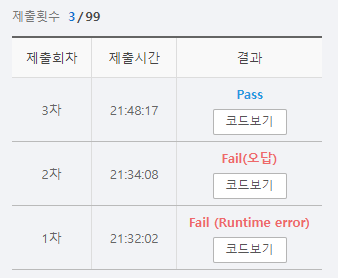

# SWEA 14195 미생물 관찰

### 문제 

https://swexpertacademy.com/main/code/userProblem/userProblemDetail.do?contestProbId=AX_Pn1I6fBQDFARi

<hr>


### 풀이

현재 idx의 value가 A 일 때와 B 일 때를 나누어서 dfs를 순회하며 그 결과를 각각의 A 리스트와 B 리스트에 추가해줌

<hr>


### 코드

```python
import sys
sys.stdin = open('input.txt')


def dfs(start):
    global temp
    global visited
    global cnt
    visited[start[0]][start[1]] = 1
    cnt += 1
    if cnt > temp:
        temp = cnt

    for i in range(4):
        nr = start[0] + d[i][0]
        nc = start[1] + d[i][1]
        if 0 <= nr < N and 0 <= nc < M and visited[nr][nc] != 1 and arr[start[0]][start[1]] == arr[nr][nc]: # 기존과 같을 때만 dfs를 순회

            dfs([nr,nc])

d = [(-1,0),(1,0),(0,-1),(0,1)]

T = int(input())


for tc in range(T):
    N, M = map(int, input().split())

    arr = [list(list(input())) for _ in range(N)]

    visited = [[0]*M for _ in range(N)]
    A = [0]                                             # max 를 사용하기 위해 리스트의 초기값에 0을 넣어줌
    B = [0]
    for i in range(N):
        for j in range(M):
            temp = 0
            if arr[i][j] == 'A' and visited[i][j] != 1: # A일 때는 dfs 순회 후 A 배열에 추가
                cnt = 0
                dfs([i,j])
                A.append(temp)
            elif arr[i][j] == 'B' and visited[i][j] != 1:   # B일 때는 dfs 순회 후 B 배열에 추가
                cnt = 0
                dfs([i, j])
                B.append(temp)
            elif arr[i][j] =='_':
                visited[i][j] = 1

    print(f'#{tc+1} {len(A)-1} {len(B)-1} {max(max(A),max(B))}')    # 길이와 최댓값을 구해서 출력
```

<hr>


### 결과



max로 최대값을 구할 때 리스트가 비어있느 경우를 고려하지 못해서 runtime error가 발생하였다. 따라서 해당 부분을 수정하기 위해 처음에 리스트에 0을 넣어주고 시작하였다.