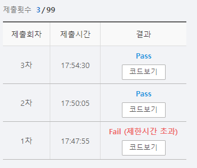

# SWEA 1795 인수의 생일 파티

### 문제 

https://swexpertacademy.com/main/code/problem/problemDetail.do?contestProbId=AV4xuqCqBeUDFAUx


### 풀이

1. 다익스트라 알고리즘을 활용
1. 왕복을 계산하는 것임으로 시작 노드와 정상 노드를 정상적으로 받아서 1번
1. 시작 노드와 정상 노드를 반대로 받아서 1번
1. 위와 같이 수행 후 더했을 때 최대가 되는 값을 출력


### 코드

```python
import sys
import heapq
sys.stdin = open('input.txt')

T = int(input())

def dij(X,graph):                               # 다익스트라 알고리즘
    Q = [(0, X)]
    dist = [-1] * (N + 1)
    while Q:                                    # Q가 빌 때까지 반복 수행
        time, node = heapq.heappop(Q)           # 우선 순위 Q를 통해 가중치를 기준으로 작은 값부터 뽑아냄
        if dist[node] == -1:                    # 아직 도착하지 않은 정점이면
            dist[node] = time                   # 해당 정점까지 도달하는 비용을 넣어주고
            for v, w in graph[node]:            # 해당 정점에서 다른 인접 정점을 추출
                alt = time + w                  # 기존에 time에 인접 정점까지 가는 비용을 더해서 우선 순위 Q에 넣어줌
                heapq.heappush(Q, (alt, v))
    return dist

for tc in range(1):
    N, M, X = map(int, input().split())
    graph1 = [[] for _ in range(N + 1)]
    graph2 = [[] for _ in range(N + 1)]
    for _ in range(M):
        u, v, w = map(int, input().split())
        graph1[u].append((v, w))            # 시작과 도착 노드를 정상적으로 입력
        graph2[v].append((u, w))            # 시작과 도착 노드를 반대로 입력

    dist1 = dij(X,graph1)                   # X에서 다른 정점으로 가는 거
    dist2 = dij(X, graph2)                  # 다른 정점에서 X로 오는 거
    result = 0
    print(dist2)
    for i in range(1,N+1):
        result = max(result, dist1[i]+dist2[i]) # 오는 것과 가는 것의 합이 최대가 되는 것을 뽑아낸다
    print(f'#{tc+1} {result}')
```

<hr>


### 결과



다익스트르 알고리즘 구현과 왕복을 계산할 때 굳이 모든 노드에서 다익스트라 알고리즘을 적용해야되는 게 아니다라는 것을 아는지 물어보는 문제이다.

해당 부분은 이미 알고 있었지만 우선 순위 Q 부분을 라이브러리를 사용하지 않고 직접 가중치 기준으로 정렬해가며 문제를 풀려고하니 시간 초과에 걸렸다....

heapq 를 사용하니 시간이 매우 빨랐다... 고맙다 이것아.. 앞으로는 자주 애용해야겠다.(코테에서도 쓸 수 있나여??)
