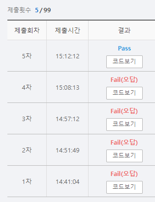

# SWEA 2115 벌꿀 채취

### 문제 

https://swexpertacademy.com/main/code/problem/problemDetail.do?contestProbId=AV5V4A46AdIDFAWu

<hr>


### 풀이

1. 벌꿀을 수집하기 위해 순회하는 기능 구현
2. 벌꿀을 담을 통의 개수가 주어졌을 때 어떤 것을 선택하는게 가장 효율적인지 구현
3. 위 기능을 담아서 재귀를 돌 때 이미 구해놓은 최댓값은 dp 배열에 넣어둠으로써 같은 작업을 반복하지 않도록 함

<hr>


### 코드

```python
import sys
sys.stdin = open('input.txt')

'''
필요한 기능
1. 해당 좌표에서 최대 벌꿀
2. 순회하는 기능
'''

def get_value(idx, M, C):
    visit = [0] * M
    idx_all = []
    for i in range(M):
        idx_all.append([idx[0],idx[1]+i])
    result_end = 0
    for i in range(M, 0,-1):
        def get_combi(n, start, temp,temp2, C):
            nonlocal visit  # 모든 조합의 경우의 수를 구하는 함수
            nonlocal idx_all
            nonlocal result_end
            if len(temp) == n:  # 조합의 개수가 원하는 수가 되는 함수 종료
                if sum(temp) > C:
                    return
                else:
                    if sum(temp2) >= result_end:
                        result_end = sum(temp2)
                    return
            for k in range(start, len(idx_all)):  # start부터 순회하는데 다음 재귀를 호출 할 떄는 현재 i가 순회 시작점이 됨
                if visit[k] == 0:
                    visit[k] = 1
                    get_combi(n, k, temp + [arr[idx_all[k][0]][idx_all[k][1]]],temp2 + [(arr[idx_all[k][0]][idx_all[k][1]])**2], C)
                    visit[k] = 0
        get_combi(i,0,[],[],C)

    return result_end

T = int(input())

for tc in range(T):
    N, M, C = map(int, input().split())

    arr = [list(map(int, input().split())) for _ in range(N)]
    visited = [[0]*(N-M+1) for _ in range(N)]
    dp = [[-1]*(N-M+1) for _ in range(N)]

    result_arr = [[0]*(N-M+1) for _ in range(N)]
    for i in range(N):
        for j in range(N-M+1):
            for m in range(M):
                if j+m < N-M+1:
                    visited[i][j+m] = 1
                if 0 <= j-m:
                    visited[i][j-m] = 1
            if dp[i][j] == -1:
                dp[i][j] = get_value([i,j], M, C)

            dp2 = [[-1] * (N - M + 1) for _ in range(N)]
            for p in range(N):
                for q in range(N-M+1):
                    if visited[p][q] == 1:
                        continue
                    else:
                        if dp[p][q] == -1:
                            dp[p][q] = get_value([p,q], M ,C)
                    dp2[p][q] = dp[p][q]
            result_arr[i][j] = dp[i][j]+max(list(map(lambda n:max(n),dp2)))
    print(f'#{tc+1} {max(list(map(lambda n:max(n),result_arr)))}')


```

<hr>


### 결과



문제에서 요구하는 기능 자체는 간단하지만 구현은 쉽지 않았다고 생각이 든다. dp를 사용하면 훨씬 효율적이라는 것을 문제 풀면서 알았지만 구현하는 부분이 상당히 지저분했다. dp에 대한 기초적인 문제들부터 풀면서 훈련해야겠다.