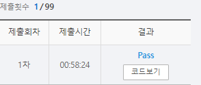

# SWEA 2806 N-Queen

### 문제 

https://swexpertacademy.com/main/code/problem/problemDetail.do?contestProbId=AV7GKs06AU0DFAXB

<hr>


### 풀이

queen 한 행에 1개, 한 열에 1개만 존재할 수 있다.

따라서 열의 수(N) 만큼 재귀 내에서 순회하면서 다음 재귀로 넘어갈 때마다 행의 값만 +1 해서 넘겨준다. 이렇게 하면 한 행에서 처음 열부터 마지막 열까지 가능한 경우의 수를 체크할 수 있다.

이때 같은 같은 열에, 같은 대각선에 퀸이 있는지 확인하여 퀸이 없는 경우에만 다음 재귀를 호출하도록 한다.

<hr>


### 코드

```python
import sys
sys.stdin = open('input.txt')

d = [(-1,-1), (-1,1)]

def recur(row, col_list,cross):
    global cnt

    if len(col_list) == N :                                 # col_list에 담긴 요소의 개수가 N과 같다면 cnt르 1추가하고 종료
        cnt += 1
        return

    if row >= N:                                            # 행을 N 만큼 순회했다면 종료
        return

    for i in range(N):                                      # 열을 주어진 N만큼 순회
        if i not in col_list and (row,i) not in cross:      # i가 아직 방문하지 않은 열이고 방문하지 않은 대각이면 진행
            cross_check = 0                                 # 행의 수만큼만 앞의 대각에 퀸이 존재하는 확인
            for j in range(1, row+1):
                if (row+j*d[0][0],i+j*d[0][1]) in cross or (row+j*d[1][0],i+j*d[1][1]) in cross:
                    cross_check +=1                         # 앞의 대각에 퀸이 존재하면 cross_check를 1로 바꾸고 순회를 종료
                    break
            if cross_check ==0:                             # 앞의 대각에 퀸이 존재하지 않앗다면 다음 재귀를 호출
                recur(row+1, col_list+[i],cross+[(row,i)])


T = int(input())

for tc in range(T):
    N = int(input())

    arr = [[0]*N for _ in range(N)]
    cnt = 0
    recur(0, [],[])
    print(f'#{tc+1} {cnt}')
```

<hr>


### 결과



대각에 퀸이 존재하는 지를 체크하는 부분이 상당히 인위적이라고 생각이 들었다.

더 예쁘게 방문체크를 할 수 있는 방법이 있는 고민해보면 좋을 것 같다.